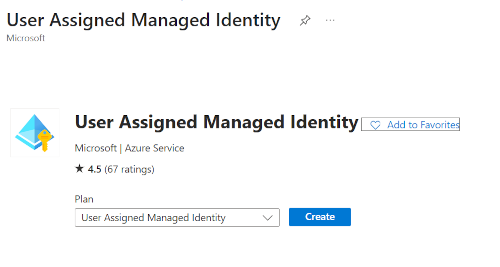
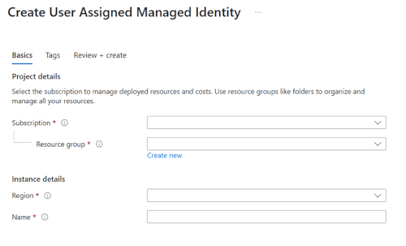
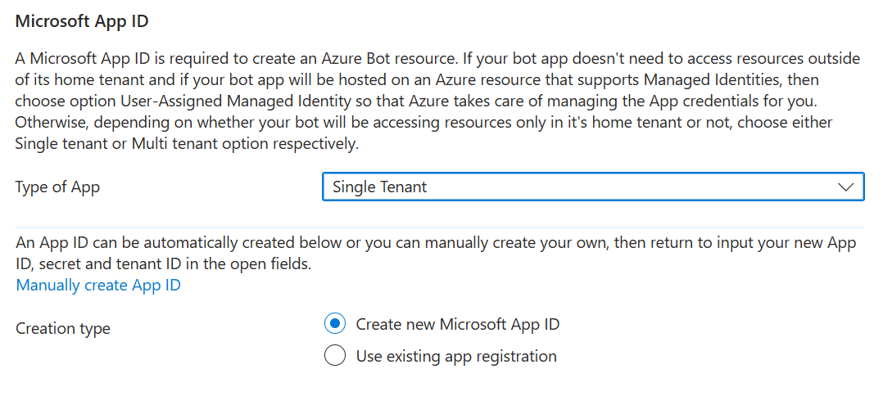
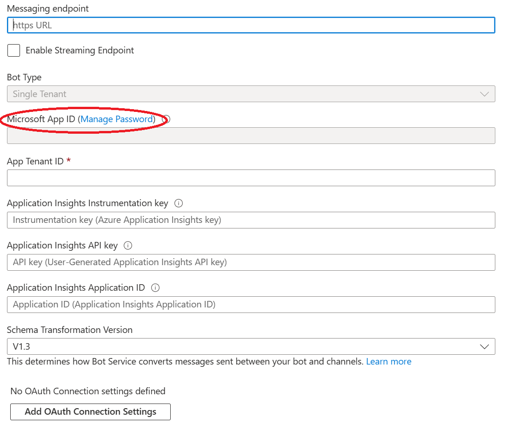
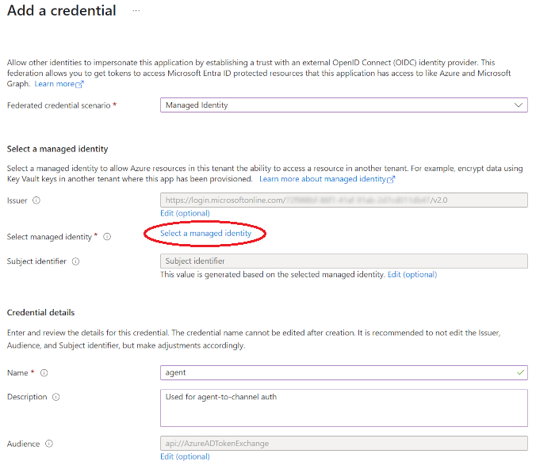

# Register a Single Tenant Agent using Federated Credentials for an Azure Bot

This article shows how to register a agent with Azure AI Bot Service.

Your can manage your agent identity in Azure in a few different ways.

- As a user-assigned managed identity, so that you don't need to manage the bot's credentials yourself.
- As a single-tenant app using secrets, certificates, or Federated Credentials.

> These instructions are for SingleTenant with Federated Credentials. If you plan to use the agent for local debugging then Federated Credentials will not work. 
> If you are on the Microsoft Tenant, using either MultiTenant or SingleTenant with a client secret is prohibited.  There are limited options for running locally in this case. Certiciate SN+I is a viable alternative. If this doesn't work for you, the only alternative is to use [Managed Identity](azurebot-create-msi.md) and deploy the agent code to Azure and run there.

## Create the resources

Create the Azure Bot resource. This allows you to register your agent with the Azure AI Bot Service.

1. Go to the Azure portal.
 
1. Create a **User Assigned Managed Identity**
   1. In the right pane, find/select **Create a resource** and select **User Assigned Managed Identity**
   
       

   1. Select **Create** and supply the required information
   
       
   
   1. Complete creation by selecting **Create**.  When it's done, click on **Go to resource**

   1. Record the **ClientId**.  This will be used later when setting up Federated Credentials on the App Registration.
      - This is also used when configuring the Agent settings, and is the `FederatedClientId` setting. 

1. Create the Azure Bot: In the right pane, select **Create a resource**.

1. Find and select the **Azure Bot** card.

   

1. Select **Create**.

1. Enter values in the required fields and review and update settings.

   a. Provide information under Project details. Select whether your agent will have global or local data residency. Currently, the local data residency feature is available for resources in the "westeurope" and "centralindia" region. For more information, see [Regionalization in Azure AI Bot Service](https://learn.microsoft.com/en-us/azure/bot-service/bot-builder-concept-regionalization?view=azure-bot-service-4.0).

   

   b. Provide information under Microsoft App ID. Select how your agent identity will be managed in Azure and whether to create a new identity or use an existing one.

   

1. Select **Review + create**.

1. If the validation passes, select **Create**.

1. Once the deployment is completed, select **Go to resource**. You should see the agent and related resources listed in the resource group you selected.

1. If this is a Teams bot
   1. Select **Settings** on the left sidebar, then **Channels**.
   1. Select **Microsoft Teams** from the list and choose appropriate options.

1. Select **Settings**, then **Configuration**

1. Select **Manage Password** next to **Microsoft App ID**
 
   

1. On the **Overview** pane, record the **Application (client) ID** and **Directory (tenant) ID**
   - This is used when configuring the Agent settings, and is the `ClientId` and `TenantId` settings. 

1. Select **Certificates & secrets** on the left then **Client secrets**.  If there is a secret listed, you can delete this.  It will not be used.

1. Select **Federated credentials**
 
1. Click **+ Add credential**

1. Set credential properties

   

   1. **Federated credential scenario**: **Managed Identity**
   1. Click **Select a managed identity** and chose the User Managed Identity created above
   1. Set the **Name**
   1. Click **Add** when done

## Further reading
- [Configuring DotNet Agent Auth](https://aka.ms/AgentsSDK-DotNetMSALAuth)
- [Configuring JS Agent Auth](https://aka.ms/AgentsSDK-JSMSALAuth)