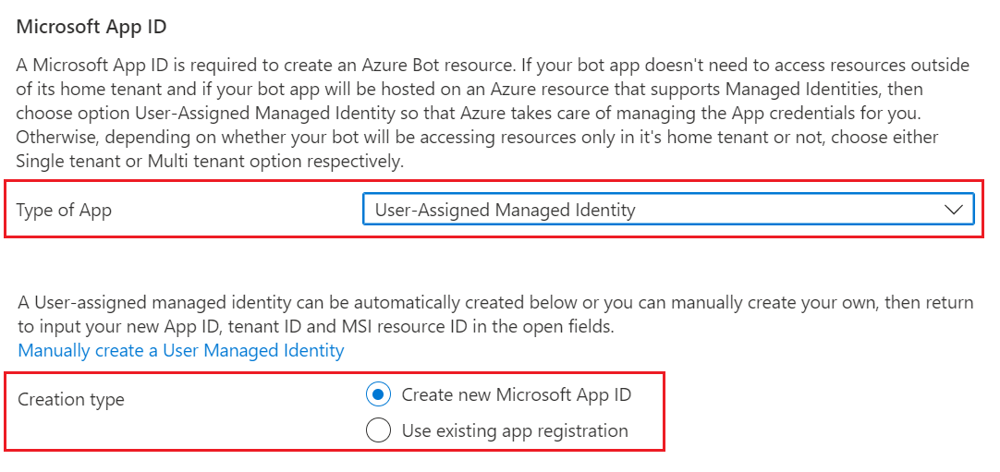

# Register an Agent using Managed Identity for an Azure Bot

This article shows how to register an agent with the Azure AI Bot Service.

You can manage your agent identity in Azure in a few different ways.

- As a user-assigned managed identity, so that you don't need to manage the bot's credentials yourself.
- As a single-tenant app using secrets, certificates, or Federated Credentials.

> These instructions are for user-assigned managed Identity. If you plan to use the agent for local debugging then Managed Identity will not work. 
> For those on the Microsoft Tenant, using either MultiTenant or SingleTenant with a secret is prohibited.  There are limited options for running locally in this case, with Certiciate SN+I being a viable alternative.  If this does not work for you, the only alternative is to deploy the Agent code to Azure and run there.

## Create the resource

Create the Azure Bot resource. This allows you to register your agent with the Azure AI Bot Service.

1. Go to the Azure portal.

1. In the right pane, select **Create a resource**.

1. Find and select the **Azure Bot** card.

   

1. Select **Create**.

1. Enter values in the required fields and review and update settings.

   a. Provide information under **Project details**. Select whether your agent will have global or local data residency. Currently, the local data residency feature is available for resources in the "westeurope" and "centralindia" region. For more information, see [Regionalization in Azure AI Bot Service](https://learn.microsoft.com/en-us/azure/bot-service/bot-builder-concept-regionalization?view=azure-bot-service-4.0).

   

   b. Provide information under **Microsoft App ID**. Select how your agent identity will be managed in Azure and whether to create a new identity or use an existing one.

   

1. Select **Review + create**.

1. If the validation passes, select **Create**.

1. Once the deployment is completed, select **Go to resource**. You should see the agent and related resources listed in the resource group you selected.

1. If this is a Teams bot

   1. Select **Settings** on the left sidebar, then **Channels**.
   1. Select **Microsoft Teams** from the list and choose appropriate options.

## Further reading
- [Configuring DotNet Agent Auth](https://aka.ms/AgentsSDK-DotNetMSALAuth)
- [Configuring JS Agent Auth](https://aka.ms/AgentsSDK-JSMSALAuth)