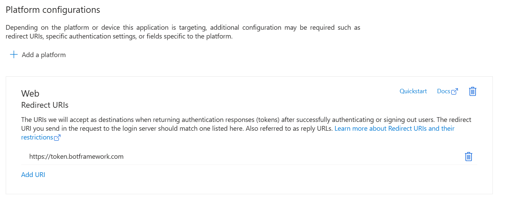

# Add support for Federated Identity Credential based User Authorization to an agent

The Azure AI Bot Service facilitates the development of agents that can access online resources requiring user authentication. Your agent doesn't need to manage authentication tokens because Azure does it for you. Azure uses OAuth 2.0 to generate a token based on each user's credentials. Your agent uses the token generated by Azure to access those resources. In this way, the user doesn't have to provide ID and password to the agent to access a secured resource but only to a trusted identity provider.

> [!IMPORTANT]
> Web Chat and Direct Line considerations: You need to use Direct Line with enhanced authentication enabled to mitigate security risks when connecting to an agent using the Web Chat control. For more information, see [Direct Line enhanced authentication](https://learn.microsoft.com/en-us/azure/bot-service/bot-builder-security-enhanced?view=azure-bot-service-4.0).

To setup OAuth on agent, [register an Azure Bot](https://microsoft.github.io/Agents/HowTo/azurebot-create-single-secret.html) if you haven't done so already.

> [!IMPORTANT]
> Whenever you register an agent in Azure, the agent gets assigned an Microsoft Entra ID application. However, this application secures channel-to-bot access. You need an additional Microsoft Entra ID application for each external secured resource you want the agent to access on behalf of the user.

## Microsoft Entra ID identity service

The Microsoft Entra ID is a cloud identity service that allows you to build applications that securely sign in users using industry standard protocols like OAuth 2.0.

You can use one of these three identity services:

1. Microsoft identity platform (v2.0): Also known as the *Azure Active Directory v2* endpoint, which is an evolution of the Azure AD platform (v1.0).
1. Federated Credentials: Also known as *AAD v2 with Federated Credentials*.  Note that this currently only supports Single Tenant applications.
1. Certificates: Also known as *AAD v2 with Certificates*.

These allow you to build applications that sign in to all Microsoft identity providers and get tokens to call Microsoft APIs, such as Microsoft Graph, or other APIs that developers have built.

## Create the Microsoft Entra ID identity provider

This section shows how to create an Microsoft Entra ID identity provider that uses OAuth 2.0 to authenticate the agent for Graph.

> [!TIP]
> You'll need to create and register the Microsoft Entra ID application in a tenant in which you can consent to delegate permissions requested by an application.

1. Open the Microsoft Entra ID panel in the Azure portal. If you aren't in the correct tenant, select Switch directory to switch to the correct tenant. (For information on how to create a tenant, see Access the portal and create a tenant.)

1. Open the **App registrations** panel.

1. Setup App Registration
   1. For **Teams SSO** open the existing App Registration for the Agent/Azure Bot.
      1. On the **Authentication** pane if you don't see a **Web** platform, selct **+ Add a platform**.
         1. Select **Web**
         1. Enter the **Redirect URI** from the table in the next step.
         1. Click **Configure**

            
      
   1. For other channels or OAuth
      1. In the **App registrations** panel, select **New registration**.

      1. Fill in the required fields and create the app registration.

         1. Name your application.

         1. Select the **Supported account types** for your application. Select Single Tenant.

         1. For the **Redirect URI**, select **Web** and set the URL to one of the supported OAuth redirect URLs.
  
            |Data residency |Cloud |OAuth URL |OAuth Redirect URL|
            |-----------------|-------|-----------|------------------|
            |None   |Public |https://token.botframework.com	|https://token.botframework.com/.auth/web/redirect|
            |Europe |Public |https://europe.token.botframework.com|https://europe.token.botframework.com/.auth/web/redirect|
            |United States |Public |https://unitedstates.token.botframework.com	|https://unitedstates.token.botframework.com/.auth/web/redirect|
            |India  |Public |https://india.token.botframework.com|https://india.token.botframework.com/.auth/web/redirect|
            |None |Azure Government |https://token.botframework.azure.us|https://token.botframework.azure.us/.auth/web/redirect|
            |None |Azure operated by 21Vianet |https://token.botframework.azure.cn|https://token.botframework.azure.cn/.auth/web/redirect|

         1. Select **Register**.
            1. Once created, Azure displays the **Overview** page for the app.
            1. Record the **Application (client) ID** value. You use this value later as the client ID when you create the connection string and register the Microsoft Entra ID provider with the agent registration.
            1. Record the **Directory (tenant) ID** value. You use this value to register this provider application with your bot.

1. In the navigation pane, select **Certificates & secrets** to add credentials for your application.
   1. Under **Federated Credentials**, select **Add Credentials**.

      

   1. On **Add Credentials** page, Choose the **Federated credential scenario** to **Other Issuer**

      

   1. Enter values in the required fields and review and update settings
      1. Provide information under **Connect your account**.

         

      1. **Issuer** : `https://login.microsoftonline.com/{customer-tenant-ID}/v2.0`

      1. **Subject Identifier** : `/eid1/c/pub/t/{base64 encoded customer tenant ID}/a/{base64 encoded 1-P app client ID}/{unique-identifier-for-projected-identity}`

         The following table contains Base64url encoded byte-array representation of supported First party application IDs. Use this value which represents our First party app.

         |Encoded Value | Description |
         |-----------------|-------------|
         |9ExAW52n_ky4ZiS_jhpJIQ | Base64url encoded of Bot Service Token Store |
         |ND1y8_Vv60yhSNmdzSUR_A | Base64url encoded of Bot Framework Dev Portal |

         The following table contains Base64url encoded byte-array representation of some supported tenant IDs. Use the value which represents tenant of your app.

         |Encoded Value | Description |
         |-----------------|-------------|
         |v4j5cvGGr0GRqy180BHbRw |Base64url encoded MSIT tenant ID (aaaabbbb-0000-cccc-1111-dddd2222eeee)|
         |PwFflyR_6Een06vEdSvzRg |Base64url encoded PME tenant ID (bbbbcccc-1111-dddd-2222-eeee3333ffff)|
         |6q7FzcUVtk2wefyt0lBdwg |Base64url encoded Torus tenant ID (ccccdddd-2222-eeee-3333-ffff4444aaaa)|
         |IRngM2RNjE-gVVva_9XjPQ |Base64url encoded AME tenant ID (ddddeeee-3333-ffff-4444-aaaa5555bbbb)|

         The Primary Identity service owners calculate it once and provide it to their consumers.

      1. **Unique-identifier-for-projected-identity**: A Unique Identifier, of your choosing, that is used in the OAuth Connection Setting on the Azure Bot.

      1. **Audience**: *api://AzureADTokenExchange (Use Cloud specific values)*

   1. Provide information under **Credential details**.
 
      

   1. Select **Add** to add the credential.

1. Expose API endpoint
   1. Click **Expose an API** in the left rail
      - **For an Azure Bot Service Bot**: The default `api://{appid}` is suitable.
      - **For a Teams bot**: This format is REQUIRED `api://botid-{appid}` 

   1. Add a Scope
      1. Select **+ Add a scope** in the Scopes defined by this API section.

         

      1. Enter the details for configuring scope.
 
         

      1. Enter the scope name.

      1. Select the user who can give consent for this scope. The default option is **Admins only**.

      1. Enter the **Admin consent display name**.

      1. Enter the description for admin consent.

      1. Enter the **User consent display name**.

      1. Enter the user consent description.

      1. Select the **Enabled** option for state.

      1. Select **Add scope**.
 
   1. **For Teams only**, configure an authorized client application
      1. Select **+ Add a client application**.  
   
          

      1. Enter the appropriate Microsoft 365 client ID for the applications that you want to authorize for your app’s web application.

          

      1. Select one of the following client IDs:
         |Use client ID|For authorizing...|
         |-------------|------------------|
         |1fec8e78-bce4-4aaf-ab1b-5451cc387264	| Teams mobile or desktop application |
         |5e3ce6c0-2b1f-4285-8d4b-75ee78787346	| Teams web application |
         |4765445b-32c6-49b0-83e6-1d93765276ca	| Microsoft 365 web application |
         |0ec893e0-5785-4de6-99da-4ed124e5296c	| Microsoft 365 desktop application |
         |d3590ed6-52b3-4102-aeff-aad2292ab01c	| Microsoft 365 mobile application/Outlook desktop application |
         |bc59ab01-8403-45c6-8796-ac3ef710b3e3	| Outlook web application |
         |27922004-5251-4030-b22d-91ecd9a37ea4	| Outlook mobile application |

      1. Select the application ID URI you created for your app in Authorized scopes to add the scope to the web API you exposed.

      1. Select **Add application**.
 
          

1. In the navigation pane, select **API permissions** to open the **API permissions** panel. It's a best practice to explicitly set the API permissions for the app.
   1. Select **Add a permission** to show the **Request API permissions** pane.

   1. For this sample, select **Microsoft APIs** and **Microsoft Graph**.

   1. Choose **Delegated permissions** and make sure the permissions you need are selected. This sample requires theses permissions.

      > Note: Any permission marked as **ADMIN CONSENT REQUIRED** will require both a user and a tenant admin to login, so for your agent tend to stay away from these.

      - openid
      - profile
      - User.Read
      - User.ReadBasic.All

   1. Select **Add permissions**. (The first time a user accesses this app through the agent, they need to grant consent.)

1. You now have a OAuth application configured.

   > [!NOTE]
   > You'll assign the **Application (client) ID**, when you create the connection string and register the identity provider with the agent registration. See next section.

## Register the OAuth identity with the Azure Bot

The next step is to register your identity provider with your agent.

> [!NOTE]
> Single Tenant Entra Application is only supported for AAD v2 with Federated Credentials service provider. Support for multi-tenant apps will be added in future.

1. Open your bot's Azure Bot resource page in the Azure portal.

1. Select **Settings**, then **Configuration**.

1. Select the **OAuth Connection Settings** button near the bottom of the page.

1. Fill in the form as follows:

   1. **Name**. Enter a name for your connection. You use it in your agent code.

   1. **Service Provider**. Select **AAD v2 with Federated Credentials** to display service provider specific fields.

   1. **Client id**. Enter the application (client) ID you recorded for your Microsoft Entra ID identity provider(**Only Single Tenant Supported**).

   1. **Unique Identifier**. Enter the unique identifier you recorded for your Microsoft Entra ID identity provider while creating federated credentials.

   1. **Token Exchange URL**. For Teams SSO, enter the api endpoint created earlier:  `api://botid-{appId}`.  Otherwise leave blank.

   1. **Tenant ID**. Enter the **directory (tenant) ID** that you recorded earlier for your Microsoft Entra ID app or `common` depending on the supported account types selected when you created the Azure DD app. To decide which value to assign, follow these criteria:

      - When creating the Microsoft Entra ID app, if you selected **Accounts in this organizational directory only (Microsoft only - Single tenant)**, enter the tenant ID you recorded earlier for the Microsoft Entra ID app.
      - However, if you selected **Accounts in any organizational directory (Any Microsoft Entra ID directory - Multi tenant and personal Microsoft accounts e.g. Xbox, Outlook.com)** or **Accounts in any organizational directory(Microsoft Entra ID directory - Multi tenant)**, enter `common` instead of a tenant ID. Otherwise, the Microsoft Entra ID app verifies through the tenant whose ID was selected and exclude personal Microsoft accounts.

      > This is the tenant associated with the users who can be authenticated. For more information, see Tenancy in Microsoft Entra ID.

   1. For **Scopes**, enter the names of the permission you chose from the application registration. For testing purposes, you can just enter: `openid profile User.Read User.ReadBasic.All`.

   > Note: For Microsoft Entra ID, Scopes field takes a case-sensitive, space-separated list of values.

1. Select **Save**.

### Test your connection

1. Select on the connection entry to open the connection you created.
1. Select **Test Connection** at the top of the **Service Provider Connection Setting** pane.
1. The first time, this should open a new browser tab listing the permissions your app is requesting and prompt you to accept.
1. Select **Accept**.
1. This should then redirect you to a **Test Connection to your-connection-name Succeeded** page, where `your-connection-succeeded` is your specific connection name.

You can now use this connection name in your agent code to retrieve user tokens.
