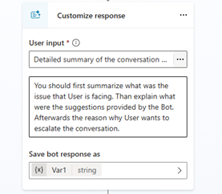
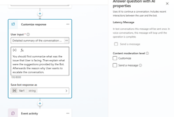
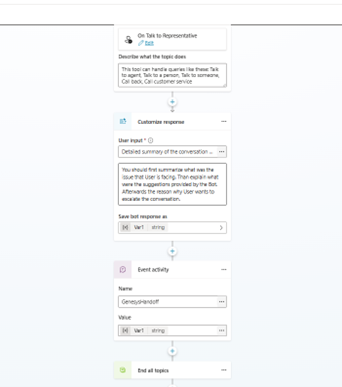
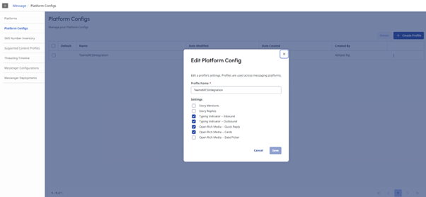
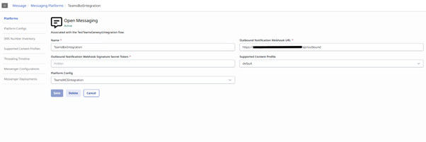
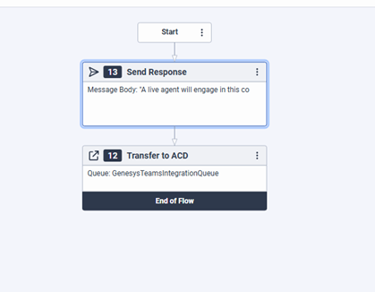
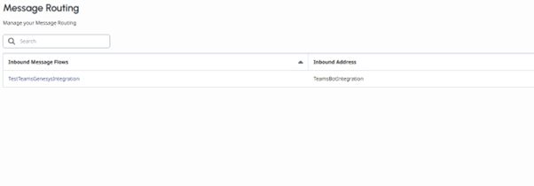

# Genesys Handoff Integration with Copilot Studio Sample Guide

This guide provides a sample setup for integrating **Genesys Handoff** functionality within a **Microsoft Copilot Studio** agent. The goal is to enable a simple conversation flow where a user request for escalation results in a handoff to a human agent via Genesys.

---

## 1. Prerequisites

Ensure you have access to the following software and platform credentials:

| Type | Item | Requirement |
| :--- | :--- | :--- |
| **Software** | [.NET SDK 8.0](https://dotnet.microsoft.com/en-us/download/dotnet/8.0) | Required for running the sample code. |
| | [Dev Tunnels](https://learn.microsoft.com/azure/developer/dev-tunnels/get-started?tabs=windows) | Essential for local development and debugging. |
| | [Microsoft 365 Agents Toolkit](https://github.com/OfficeDev/microsoft-365-agents-toolkit) | The SDK used for building the agent. |
| **Platforms** | [Azure Subscription](https://azure.microsoft.com/en-us/free/) | Required for hosting the agent infrastructure. |
| | [Microsoft Copilot Studio Platform](https://copilotstudio.microsoft.com) | Access to configure and publish the Copilot. |
| | [Genesys Dashboard](https://www.genesys.com) | Access credentials for managing and monitoring Genesys interactions. |
| | [Genesys Open Messaging](https://developer.genesys.cloud/commdigital/digital/openmessaging/openmessaging-apis) | Required for setting up messaging flows and configurations. Genesys Open Messaging API v2 is getting used in this sample. |

---

## 2. Running the Sample and Initial Setup

The overall setup involves configuring Copilot Studio, Genesys, and the Agent SDK.

### 2.1. Copilot Studio Configuration

1.  **Create a Copilot Agent** in [Copilot Studio](https://copilotstudio.microsoft.com).
2.  **Update the "Escalate" Topic:**
    * Navigate to the **Topics** section and select the built-in **"Escalate"** topic.
    * Modify the topic to capture the user's intent to escalate and initiate the handoff to Genesys.
    * **Create a Customize Response Node:**
        * Add a **Customize Response Node**.
        * Use it to **summarize the conversation** for the human agent.
        * ]]
        * **Save the bot response** into a variable (e.g., `EscalationSummary`). This variable will be passed to Genesys.
        * **Content Moderation Settings:** Uncheck the **"Send a message"** checkbox under **"Content moderation level"** to prevent the node from sending an automatic message to the user.
        * ]
    * **Create an Event Node:**
        * Add an **Event Node** and name it **"GenesysHandoff"**.
        * Set its value to the bot response variable created in the previous step (e.g., `EscalationSummary`).
        * ]
    * **Verify Topic Flow:** The final structure of your Escalate topic should clearly lead to the event node for a smooth handoff.
3.  **Publish the Copilot.**
4.  **Note Metadata Values:** Go to **Settings** > **Advanced** > **Metadata** and record the following:
    * `Schema name`
    * `Environment Id`
5.  **Update `appsettings.json` (Copilot Studio Agent):** Set the collected values in the configuration file for the Agent SDK.

    ```json
    "CopilotStudioAgent": {
      "EnvironmentId": "", // Environment ID of the environment with the CopilotStudio App.
      "SchemaName": ""     // Schema Name of the Copilot to use.
    }
    ```

---

### 2.2. Genesys Configuration

1.  **Configure OAuth Integration:**
    * Navigate to **Admin** > **Integrations** > **OAuth**.
    * Create a **New OAuth Client** for your agent.
    * Ensure you assign the **Admin** role to this client for necessary permissions.
2.  **Configure Platform for Messaging Flow (Platform Configs):**
    * Go to **Admin** > **Message** > **Platform Configs**.
    * Create a new **Platform Config** specific to this flow.
    * ]
3.  **Configure Open Messaging:**
    * Go to **Admin** > **Message** > **Platforms**.
    * Create a new **Open Messaging** configuration.
    * **Update the Outbound Notifications Webhook URL** to point to your Azure hosting endpoint (or dev tunnel URL for local testing).
        ```
        https://{{appServiceEndpoint}}/api/outbound
        ```
    * 
    * **Copy the GUID** from the Open Messaging configuration page URL. This GUID is required in the Agent SDK's `appsettings.json`.
4.  **Configure Inbound Message Flow (Genesys Architect):**
    * Go to **Admin** > **Architect** > **Inbound Messages**.
    * Create a **New Flow** for processing incoming messages.
    * In the flow, use the **"Transfer to ACD"** action.
    * Select the specific **Queue** where escalated messages should be routed to the human agents  .
    
5.  **Configure Message Routing:**
    * Go to **Admin** > **Routing** > **Message Routing**.
    * Create a **New Message Routing** configuration.
    * Associate it with your **Platform Configuration** (from step 2) and the **Inbound Message Flow** (from step 4).
    * 
6.  **Add Genesys Configurations to Agent SDK:** Update the `appsettings.json` file with the details collected from the Genesys setup steps.

    ```json
    "Genesys": {
      "OAuthClientId": "",     // OAuth Client ID created in Genesys
      "OAuthClientSecret": "", // OAuth Client Secret created in Genesys
      "OrganizationId": "",    // Organization ID from Genesys
      "PlatformConfigId": ""   // Platform Config ID created in Genesys
    }
    ```

---

### 2.3. Agent SDK Setup

1.  **Create an Azure Bot:**
    * Create an Azure Bot using one of the following authentication types:
        * [Single Tenant, Client Secret](https://learn.microsoft.com/en-us/microsoft-365/agents-sdk/azure-bot-create-single-secret)
        * [Single Tenant, Federated Credentials](https://learn.microsoft.com/en-us/microsoft-365/agents-sdk/azure-bot-create-federated-credentials)
        * [User Assigned Managed Identity](https://learn.microsoft.com/en-us/microsoft-365/agents-sdk/azure-bot-create-managed-identity)
    * ***Important Note:*** For local development via dev tunnels, only **Client Secret** or **Certificates** are supported.
    * **Follow the *Next Steps* in the documentation** to configure agent settings after creation.

2.  **Set up OAuth for Agent App Registration:**
    * OAuth should be set up on the **same App Registration** used for the agent.
    * Perform the steps in [Add user authorization using Federated Identity Credential](https://learn.microsoft.com/en-us/microsoft-365/agents-sdk/azure-bot-user-authorization-federated-credentials) with the following **API Permissions** required:
        * **Dynamics CRM**: `user_impersonation`
        * **Graph**: `User.Read`
        * **Power Platform API**: `CopilotStudio.Copilots.Invoke`
    * **Grant Admin Consent** for your tenant for these permissions.

3.  **Configure .NET Agent for OAuth:** Follow the guide for [configuring your .NET Agent to use OAuth](https://learn.microsoft.com/en-us/microsoft-365/agents-sdk/agent-oauth-configuration-dotnet).

4.  **Run the Agent:**

    * **Local Run (Dev Tunnels):**
        * **Start the dev tunnel** using the command below, enabling anonymous access:
            ```bash
            devtunnel host -p 3978 --allow-anonymous
            ```
        * In the **Azure Bot** settings, update the **Messaging endpoint** to: `{tunnel-url}/api/messages`
        * Start the Agent in Visual Studio or your IDE.

    * **Deployment to Azure:**
        * Deploy the Agent code (