# GenesysHandoff sample – setup and usage guide

**Repository:** microsoft/Agents – samples/dotnet/GenesysHandoff

This guide walks you through configuring, running, and understanding the GenesysHandoff sample.

---

## Introduction

The **GenesysHandoff** sample demonstrates how a Microsoft Copilot Studio Agent (bot) can seamlessly **hand off a conversation to a live agent** in **Genesys Cloud**. When a user interacting with the bot (e.g., in Microsoft Teams) needs human assistance, the bot will transfer the chat to a Genesys Cloud contact center agent, **preserving the conversation context**.

**Why this is useful:** It combines the efficiency of a bot for common queries with the personal touch of human agents for complex issues. The user stays in the same chat (Teams), and the Genesys agent responds through Genesys Cloud; the GenesysHandoff integration passes messages back and forth behind the scenes.

**Who should use this guide:** Developers who want to run the GenesysHandoff sample. This guide assumes only basic knowledge of bots and walks through all required Azure and Genesys setup.

---

## 1. Prerequisites

Before you begin, ensure you have access to the following software and platform credentials:

### Software Requirements

| Item | Requirement |
| :--- | :--- |
| [.NET SDK 8.0](https://dotnet.microsoft.com/en-us/download/dotnet/8.0) | Required to build and run the sample code. |
| [Dev Tunnels](https://learn.microsoft.com/azure/developer/dev-tunnels/get-started?tabs=windows) | Recommended for local development and debugging. |
| [Microsoft 365 Agents Toolkit](https://github.com/OfficeDev/microsoft-365-agents-toolkit) | SDK used for building the agent. |
| **Visual Studio 2022** (or later) or VS Code with C# extension | For editing and running the project. |
| **Git** | To clone the repository. |
| (Optional) **Azure CLI** | For alternative deployment steps. |
| (Optional) **ngrok** | Alternative tunneling tool if not using Dev Tunnels. |

### Platform Requirements

| Platform | Requirement |
| :--- | :--- |
| [Azure Subscription](https://azure.microsoft.com/en-us/free/) | Required for hosting the agent infrastructure. Free tier suffices for testing. |
| [Microsoft Copilot Studio](https://copilotstudio.microsoft.com) | Access to configure and publish the copilot. |
| [Genesys Cloud](https://www.genesys.com) | Access credentials for managing and monitoring Genesys interactions. |
| [Genesys Open Messaging](https://developer.genesys.cloud/commdigital/digital/openmessaging/openmessaging-apis) | Required for setting up messaging flows and configurations. Genesys Open Messaging API v2 is used in this sample. |

### Genesys Cloud Requirements

You will need **admin permissions** in Genesys Cloud to:
- Create an Open Messaging integration
- Create an OAuth client (for API access)
- Configure Architect flows
- Access a Genesys **Queue** and a **User (Agent)** who can receive messages (for testing the handoff)

---

## 2. Setting Up the Copilot Studio Agent (Bot)

First, configure your Copilot Studio agent to support escalation. This involves creating an **Escalate** topic that triggers a handoff event and making sure the bot can be contacted by external systems (Genesys).

### 2.1. Create or Identify an Agent in Copilot Studio

1. **Create an agent:** Sign in to [Microsoft Copilot Studio](https://copilotstudio.microsoft.com), go to **Agents**, and create a blank agent (for example, "Support bot with Genesys handoff"). If you are using an existing agent, open it for editing.
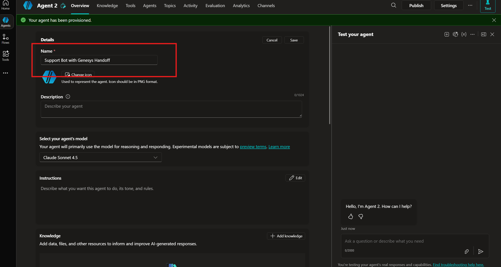
2. Ensure the agent has the **Microsoft 365 Copilot Studio** and **Microsoft Teams** channels enabled (because you will test via Teams). In Copilot Studio, go to **Channels** and add Microsoft 365 Copilot Studio and Microsoft Teams if they are not already enabled.

> **Note:** The Copilot Studio user interface evolves frequently. Button labels or menu locations in your tenant may look slightly different from the screenshots in this guide, but the underlying concepts (agents, topics, channels, customize response, event nodes) remain the same.

### 2.2. Configure the Escalation Topic

Set up the dialog logic so the bot knows when and how to hand off to Genesys Cloud. Modify the **Escalate** system topic:
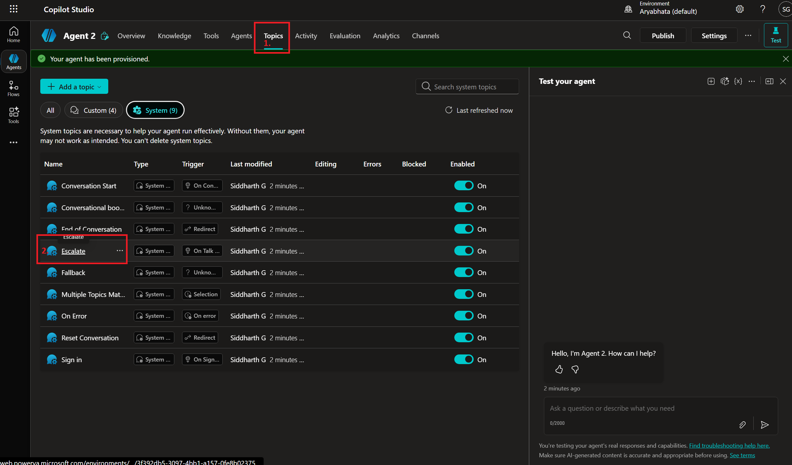

1. **Open the Escalate Topic:** In Copilot Studio's Topics list, find the **Escalate** topic (it will be under System Topics).

2. **Trigger phrases:** Add user phrases that should trigger escalation, such as:
   - `This tool can handle queries like these: Talk to agent, Talk to a person, Talk to someone, Call back, Call customer service`

3. **Create a customize response node:**
   - Add a **Customize Response Node** to summarize the conversation for the human agent.
   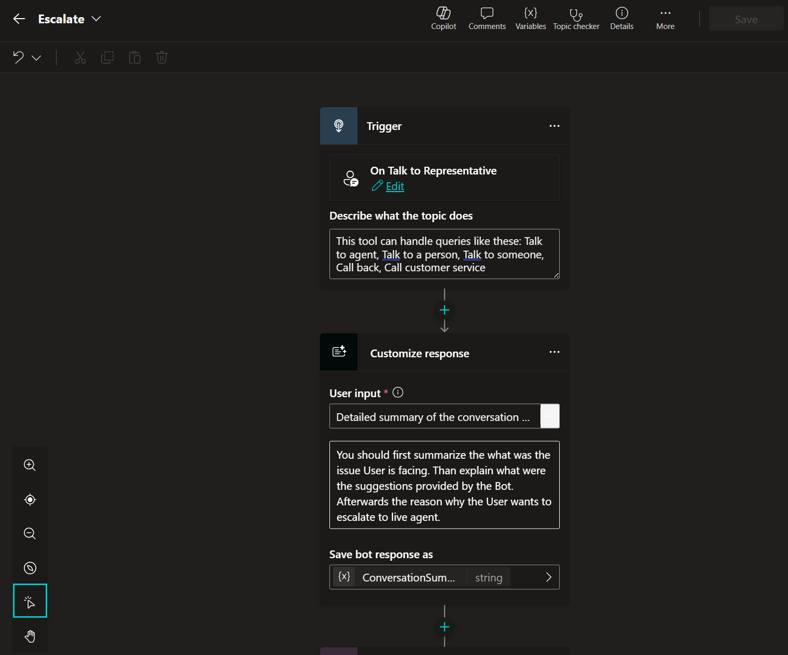
   > **Note:** In case you don't find **Customize Response Node** in the advanced section. You can open the topic in code editor mode by clicking **More** > **Open code editor** and add below **kind** in the actions section.
   ```yaml
   - kind: AnswerQuestionWithAI
      id: o0xpvl
      variable: Topic.ConversationSummary
      userInput: Detailed summary of the conversation happened so far
      additionalInstructions: "You should first summarize the what was the issue User is facing. Than explain what were the suggestions provided by the Bot. Afterwards the reason why the User wants to escalate to live agent. "
   ```
   - **Save the bot response** into a variable (e.g., `EscalationSummary`). This variable will be passed to Genesys.
   - **Content Moderation Settings:**
   - Click on three dots on Customize response node. Go to properies.
   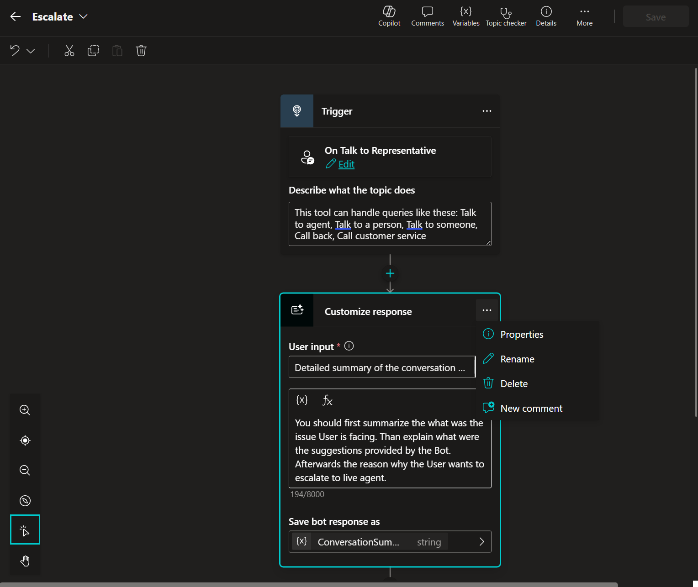 
   - Uncheck the **"Send a message"** checkbox under **"Content moderation level"** to prevent the node from sending an automatic message to the user.
    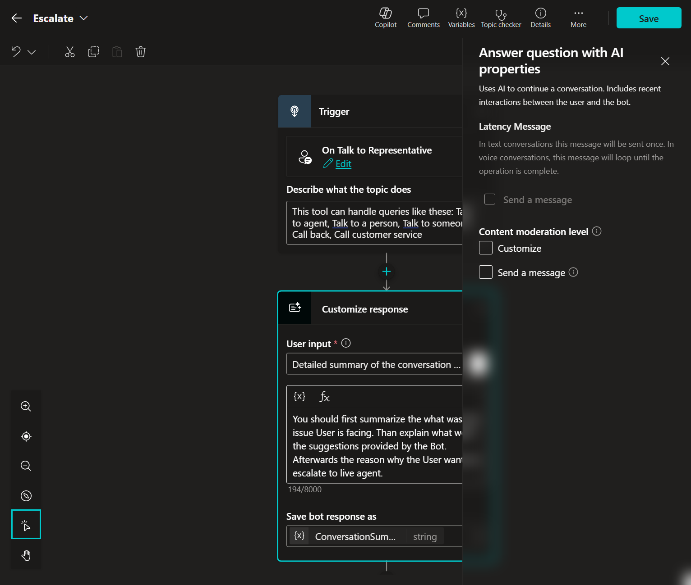

4. **Create an Event Node:**
   - Add an **Event Node** and name it **"GenesysHandoff"**.
   - Set its value to the bot response variable created in the previous step (e.g., `EscalationSummary`).
   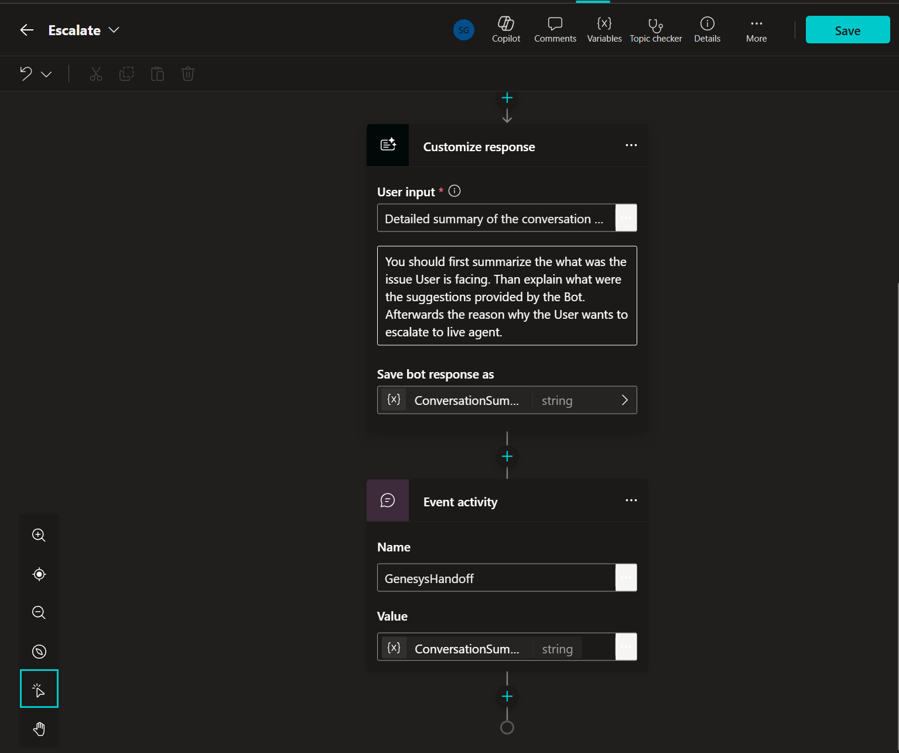

5. **Verify Topic Flow:** The final structure of your Escalate topic should be:
   - User trigger → (optional confirmation) → **Customize Response (summarize)** → **Event: GenesysHandoff**

### 2.3. Publish the Agent

1. Click **Publish** (usually in the top-right of Copilot Studio).
2. After publishing, test quickly in the Copilot Studio chat canvas: type a phrase like "I want a human." The bot should trigger the event (you may see no response, which indicates the event was triggered).

### 2.4. Retrieve Agent and Environment Metadata

We need two pieces of info from Copilot Studio to configure the integration code:

1. Go to **Settings** > **Advanced** > **Metadata** and record the following:
   - `Schema name`
   - `Environment Id`

2. **Update `appsettings.json` (Copilot Studio Agent):** Set the collected values in the configuration file:

   ```json
   "CopilotStudioAgent": {
     "EnvironmentId": "", // Environment ID of the environment with the CopilotStudio App.
     "SchemaName": ""     // Schema Name of the Copilot to use.
   }
   ```

---

## 3. Setting Up Genesys Cloud (Open Messaging Integration)

Configure Genesys Cloud to handle incoming chat from the bot and route it to a human agent.

### 3.1. Create an OAuth client (for bot API access)

The bot uses Genesys Cloud APIs to start conversations and send messages:

> **Developer account permissions (for setup):** Before creating the OAuth client, ensure your Genesys Cloud developer account has the following permissions to perform the setup steps in this section and in sections 3.2–3.5:
> - `Integrations > All`
> - `Architect > Flow > All Permissions`
>
> These are permissions for the person doing the configuration work, not for the OAuth connection itself.

1. In **Genesys Cloud Admin**, go to **IT AND INTEGRATIONS** > **OAuth**.
2. Click on **Add Client**.
3. Provide the following details:
   - **App Name**: A descriptive name for your application (e.g., "Copilot Handoff").
   - **Description**: A brief description of the app’s purpose.
   - **Grant Type**: Select **Client Credentials**.
   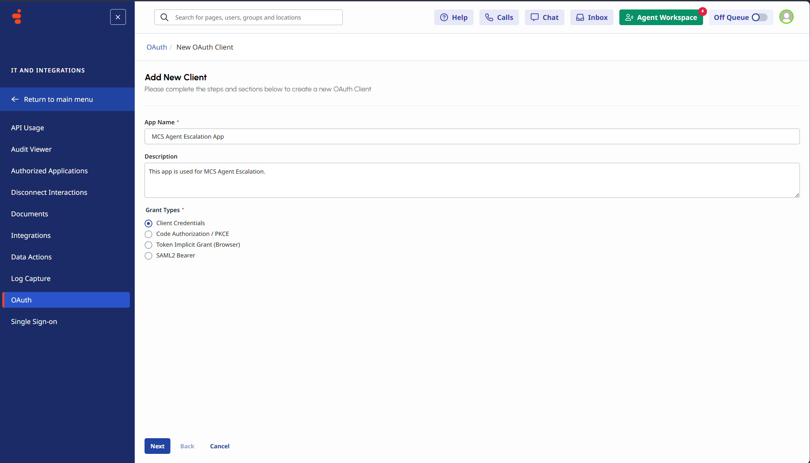
4. Click on **Next**.
5. In the **Assign roles** section, assign a custom role (for example, "Chat Integrations") with the following permission:
   - `Conversation > Message > Receive` – required for the bot to receive inbound messages
6. After creation, **copy the Client ID and Client Secret** safely.
7. Note the **OAuth token URL** for your Genesys region (for example, `https://login.usw2.pure.cloud/oauth/token` for US West).

> **Important – custom role assignment:** If you create a custom role (for example, "Chat Integrations"), the **developer account must also be assigned to that role** in Genesys Cloud. Otherwise, the role will not appear as an option when configuring the OAuth client.

### 3.2. Create a platform configuration

1. Go to **DIGITAL AND TELEPHONY** > **Message** > **Platform Configurations**.
2. Create a new **profile**.
   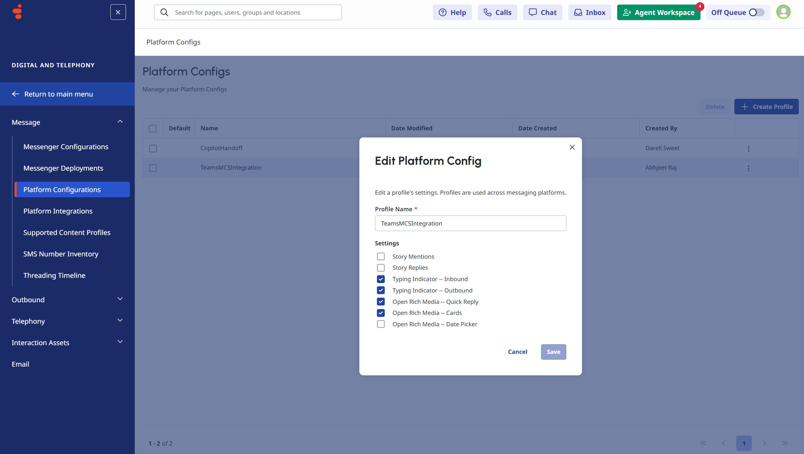

### 3.3. Create a platform integration

1. Go to **DIGITAL AND TELEPHONY** > **Message** > **Platform Integrations**.
2. Create a new **integration**.
3. **Name:** Give it a name like "Copilot Bot Handoff".
4. **Update the outbound notifications webhook URL** to point to your Azure hosting endpoint (or dev tunnel URL for local testing):
   ```
   https://{{appServiceEndpoint}}/api/outbound
   ```
   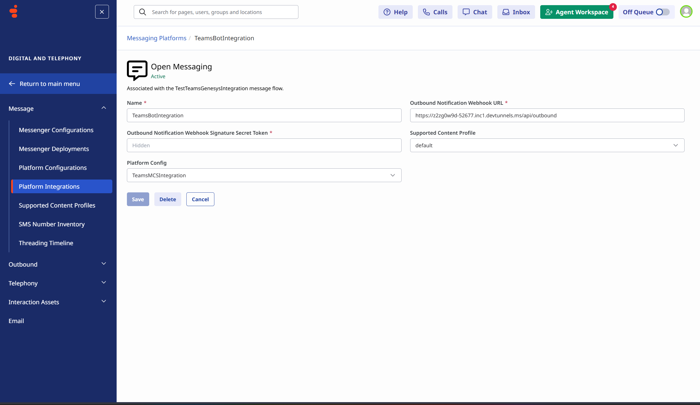
5. **Copy the integration GUID** from the Open Messaging configuration page URL. This GUID is required in the agent SDK appsettings.json.
6. **Outbound webhook secret (token):** Copy this secret so that you can verify incoming webhook requests.

### 3.4. Configure inbound message flow (Genesys Architect)

1. Go to **Orchestration** > **Architect** > **Inbound Messages**.
2. Create a **new flow** for processing incoming messages.
3. In the flow, use the **"Transfer to ACD"** action.
4. Select the specific **Queue** where escalated messages should be routed to human agents.

   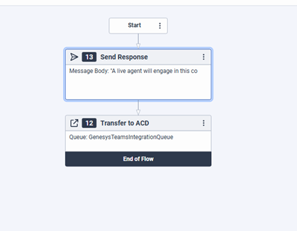
5. **Publish** the flow.

### 3.5. Configure message routing

1. Go to **Orchestration** > **Routing** > **Message routing**.
2. Click on **Attach New Address to a Flow**.
3. Associate it with your **platform configuration** (from step 3.2) and the **inbound message flow** (from step 3.4).
   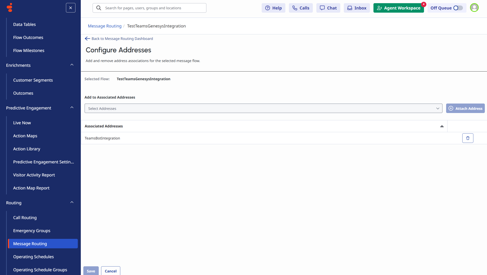

### 3.6. Add Genesys configurations to the agent SDK

Update appsettings.json with the details collected from the Genesys setup steps:

```json
"Genesys": {
  "OauthUrl": "https://login.<region>.pure.cloud/oauth/token",
  "ApiUrl": "https://api.<region>.pure.cloud",
  "IntegrationId": "",              // GUID from Open Messaging Integration
  "ClientId": "",                   // OAuth Client ID created in Genesys
  "ClientSecret": "",               // OAuth Client Secret created in Genesys
  "WebhookSignatureSecret": ""      // Optional: outboundNotificationWebhookSignatureSecretToken from Genesys integration
}
```

> **Note:** Replace `<region>` with your Genesys region code (for example, `usw2` for US-West-2 or `use2` for US-East-2).

#### Webhook signature validation (optional but recommended)

The `WebhookSignatureSecret` setting enables HMAC-SHA256 signature validation for incoming webhook requests from Genesys Cloud. When configured:

1. **In Genesys Cloud:** When you create the Open Messaging integration, Genesys Cloud generates an `outboundNotificationWebhookSignatureSecretToken`. Copy this value.
2. **In appsettings.json:** Set the `WebhookSignatureSecret` to this token value.

When enabled, the integration will:
- Validate the `X-Hub-Signature-256` header on each incoming webhook request.
- Reject requests with invalid or missing signatures (returning a 401 Unauthorized response).
- Use constant-time comparison to help prevent timing attacks.

> **Security tip:** Configure this setting in production environments to ensure that webhook requests are genuinely from Genesys Cloud and have not been tampered with.

---

## 4. Agent SDK Setup

### 4.1. Create an Azure Bot

Create an Azure Bot using one of the following authentication types:
- [Single Tenant, Client Secret](https://learn.microsoft.com/en-us/microsoft-365/agents-sdk/azure-bot-create-single-secret)
- [Single Tenant, Federated Credentials](https://learn.microsoft.com/en-us/microsoft-365/agents-sdk/azure-bot-create-federated-credentials)
- [User Assigned Managed Identity](https://learn.microsoft.com/en-us/microsoft-365/agents-sdk/azure-bot-create-managed-identity)

> ***Important note:*** For local development via dev tunnels, only **Client secret** or **Certificates** are supported.

Follow the **Next steps** section in the documentation to configure agent settings after creation.

At the end of this step, you should have **one Azure Bot resource** that you will use for this sample. The Bot **App ID** from this resource is the ID you will later:
- Use in the Azure Bot OAuth connection settings.
- Substitute for `${{AAD_APP_CLIENT_ID}}` in the Teams app manifest.
- Reference in appsettings.json if you store it there.

### 4.2. Set up OAuth for agent app registration

Set up OAuth on a **new app registration** for an exchangeable token:

#### Create a new app registration

1. In **Azure portal**, go to **Azure Active Directory** > **App registrations** > **New registration**.
2. Select **Single Tenant**.
3. Enter a name and select **Register**.

#### Configure authentication

1. Go to the **Authentication** tab.
2. Select **Add a platform**, select **Web**, and set the redirect URI to:
   ```
   https://token.botframework.com/.auth/web/redirect
   ```
3. Select **Add a platform** again, select **Mobile and desktop applications**, and add:
   ```
   http://localhost
   ```

#### Configure API permissions

1. Go to the **API permissions** tab.
2. Add the following permissions:
   - **Dynamics CRM**: `user_impersonation`
   - **Microsoft Graph**: `User.Read`
   - **Power Platform API**: `CopilotStudio.Copilots.Invoke`
3. Select **Grant admin consent** for your tenant.

> **Tip:** If you do not see **Power Platform API** in the list of APIs your organization uses, you must add the Power Platform API to your tenant. To do that, go to [Power Platform API Authentication](https://learn.microsoft.com/en-us/power-platform/admin/programmability-authentication-v2?tabs=powershell#step-2-configure-api-permissions) and follow the instructions in step 2 to add the Power Platform Admin API to your tenant.

#### Expose an API

1. Go to the **Expose an API** tab.
2. Select **Add a scope**.
3. Set the **Application ID URI** to:
   ```
   api://botid-{{appid}}
   ```
   (Replace `{{appid}}` with your App Registration's Application (client) ID)
4. Configure the scope:
   - **Scope Name**: `defaultScope`
   - **Who can consent**: `Admins and users`
   - Fill in the required **Admin consent display name** and **Admin consent description** fields.
5. Select **Add scope**.

#### Create a client secret

1. Go to the **Certificates & secrets** tab.
2. Select **New client secret**.
3. Add a description and select an expiration period.
4. Select **Add** and record the secret value. You will need this later.

#### Create Azure Bot OAuth connection

1. Go to your Azure Bot created in section 4.1.
2. Select the **Configuration** tab, and then select **Add OAuth Connection Settings**.
3. Configure the connection:
   - **Name**: Enter a name (you will use this in `appsettings.json` as `OAuthConnectionName`).
   - **Service Provider**: Select **Azure Active Directory v2**.
   - **Client ID**: The Application (client) ID from the App Registration created above.
   - **Client Secret**: The secret value created above.
   - **Tenant ID**: Your Azure AD Tenant ID.
   - **Scopes**: `api://botid-{{appid}}/defaultScope` (replace `{{appid}}` with the Client ID from the OAuth App Registration).
4. Select **Save**.

After completing sections 4.1 and 4.2, you should have exactly:
- **One Azure Bot resource** (created in 4.1).
- **One Azure AD app registration** used for OAuth (created in 4.2).

When you add the OAuth connection on the Azure Bot (this step), make sure you are configuring the **same bot** whose App ID you plan to use in your app manifest and appsettings.json. If you accidentally create multiple bots, double-check that:
- The **Bot App ID** in Azure Bot matches the ID in your manifest.json.
- The OAuth connection you create is attached to that same bot.

### 4.3. Configure .NET agent for OAuth

Follow the guide for [configuring your .NET agent to use OAuth](https://learn.microsoft.com/en-us/microsoft-365/agents-sdk/agent-oauth-configuration-dotnet).

### 4.4. Update Bot Framework credentials

Update appsettings.json with your Azure Bot registration credentials (within the `Connections.ServiceConnection.Settings` section):

```json
"Connections": {
  "ServiceConnection": {
    "Settings": {
      "ClientId": "",      // App ID from Azure Bot registration
      "ClientSecret": ""   // Client secret from Azure Bot registration
    }
  }
}
```

---

## 5. Overview of the GenesysHandoff Integration Code

Understanding how the code works helps with configuration and troubleshooting.

### Key Responsibilities

| Component | Description |
| :--- | :--- |
| **Escalation Event Handler** | Catches the `GenesysHandoff` event from the Copilot agent with the conversation summary. |
| **Genesys API Client** | Uses Genesys Cloud's API to start conversations and send messages on behalf of the user. |
| **Webhook Endpoint** | Receives messages from Genesys agents and relays them back to the user. |
| **Conversation Tracking** | Maintains mapping between bot conversations and Genesys conversations. |

### Project structure

| File | Purpose |
| :--- | :--- |
| appsettings.json | Configuration settings for Azure Bot, Genesys APIs, and the Copilot agent. |
| Program.cs | Application startup and dependency injection setup. |
| GenesysHandoffAgent.cs | Main agent logic and event handling. |
| Genesys/ | Genesys API client and related services. |

---

## 6. Running and Testing the Sample

### 6.1. Local Run (Dev Tunnels)

1. Open the GenesysHandoff solution (GenesysHandoff.sln) in Visual Studio 2022 or later.
2. Ensure that the **GenesysHandoff** project is set as the startup project and that the configuration is set to **Debug**.
3. Update appsettings.json with your Azure Bot, Copilot Studio, and Genesys configuration values as described in the earlier sections.
4. Start the dev tunnel using the following command, enabling anonymous access:
   ```bash
   devtunnel host -p 3978 --allow-anonymous
   ```
5. In the Azure Bot settings, update the **Messaging endpoint** to `{tunnel-url}/api/messages`.

6. Update the Genesys Open Messaging **outbound webhook URL** to `{tunnel-url}/api/outbound`.

7. Start the agent in Visual Studio (press **F5**) or from the command line using `dotnet run` in the project folder.

8. Ensure that a Genesys Cloud agent is available in the configured queue.

### 6.2. Deployment to Azure

1. Deploy the code using Visual Studio publish or Azure CLI:
   - In Visual Studio, right-click the project, select **Publish**, choose **Azure**, select your App Service, and publish.
   - Or use Azure CLI: `az webapp deploy`

2. Configure settings on Azure:
   - Ensure that all values from your local appsettings.json are present as application settings.
   - Double-check that sensitive values (such as `ClientSecret`) are set correctly.

3. Update the bot messaging endpoint:
   - In your Azure Bot registration, set the messaging endpoint to `https://<YourAppService>.azurewebsites.net/api/messages`.

4. Update the Genesys webhook URL:
   - Update the Open Messaging outbound webhook URL to `https://<YourAppService>.azurewebsites.net/api/outbound`.

### 6.3. Testing the Agent in Teams or M365

To test your agent in Microsoft Teams or Microsoft 365 Copilot, you must create and upload a custom app manifest.

#### 6.3.1. Update the manifest.json

1. Browse to the /appManifest folder in the project directory.

2. Edit the manifest.json file and make the following replacements:
   - Replace all instances of `${{AAD_APP_CLIENT_ID}}` with your **App ID** (the Azure AD App Registration ID created during Azure Bot setup).
   - Replace `<<BOT_DOMAIN>>` with your agent URL. For example:
     - For local development, use your dev tunnel host name (for example, `abc123.devtunnels.ms`).
     - For Azure deployment, use your App Service domain (for example, `youragent.azurewebsites.net`).

3. Create the manifest package by zipping the contents of the /appManifest folder. The .zip file must contain:
   - manifest.json
   - outline.png
   - color.png

   > **Note:** Ensure you zip the *contents* of the folder, not the folder itself. The `manifest.json` should be at the root level of the zip file.

#### 6.3.2. Configure Azure Bot Channels

Before uploading the app, ensure your Azure Bot has the Microsoft Teams channel configured:

1. In the **Azure Portal**, navigate to your Azure Bot resource.
2. Under **Settings**, select **Channels**.
3. If not already added, click **Microsoft Teams** to add the Teams channel.
4. Accept the terms of service and save the configuration.

#### 6.3.3. Upload the Custom App

1. Navigate to the [Microsoft Admin Center (MAC)](https://admin.microsoft.com).
2. Go to **Settings** > **Integrated Apps**.
3. Click **Upload Custom App**.
4. Select the `manifest.zip` file created in the previous step.
5. Follow the prompts to complete the upload and assign the app to users or groups as needed.

After a short period of time (usually a few minutes), the agent will appear in:
- **Microsoft Teams** – Available in the Apps section for chat interactions
- **Microsoft 365 Copilot** – Available as an integrated agent

> **TIP:** If you're testing during development, you can also sideload the app directly in Teams by going to **Apps** > **Manage your apps** > **Upload a custom app** (if your tenant policy allows sideloading).

> **Note on "Test in Web Chat":** The **Test in Web Chat** feature on the Azure Bot resource is not a reliable way to test this sample. Because the sample uses OAuth and an exchangeable token to call Copilot Studio and downstream services, Web Chat will often show a **Sign in** prompt that does not complete authentication, even when the bot is correctly configured and works in Teams. For end‑to‑end validation, use **Teams** (or Microsoft 365 Copilot) with the custom app manifest instead.

### 6.4. End-to-End Test

1. **Open Teams** and start a chat with your bot.
2. Say "Hello" to ensure the bot responds normally.
3. **Trigger escalation** by saying "I need a human agent."
4. In **Genesys Cloud**, accept the incoming chat as an agent.
5. As the Genesys agent, send a reply message.
6. **Verify** the reply appears in the Teams chat.
7. Reply from Teams and verify the Genesys agent receives it.

---

## 7. Usage Notes

### Session Reset

The `-reset` command allows users to start a new session with a fresh conversation ID. This clears the current conversation state, any associated escalation status, and removes stored conversation references from storage.

> **Note:** Genesys does not provide an event notification when a conversation ends on their platform. As a result, there is no automatic synchronization between the Genesys conversation lifecycle and the agent session. Using `-reset` is the recommended way to manually end an escalated session and return to the Copilot Studio flow.

---

## 8. Troubleshooting & Best Practices

### Common Issues

| Issue | Solution |
| :--- | :--- |
| **Bot doesn't hand off** | Verify the Escalation topic is configured correctly and published. Check that trigger phrases match and the event name is "GenesysHandoff". |
| **Genesys not receiving chat** | Check bot logs for API errors. Verify Genesys `IntegrationId`, OAuth credentials, and region URLs are correct. Ensure the Genesys integration is activated (not in draft mode). |
| **Agent messages not reaching user** | Verify webhook URL is correct and accessible. Check for function keys if using Azure Functions. Look for exceptions in Application Insights. Verify conversation reference mapping. |
| **Multiple responses or bot interrupts** | Ensure the bot sets a "handoff active" flag to prevent automated responses during human conversation. Check that the escalation event is the last step in the topic. |
| **Azure deployment issues** | Verify all app settings are configured in Azure. Check that `ClientId` and `ClientSecret` are correct. Use Azure Bot's "Test in Web Chat" to verify connectivity. |

### Best Practices

- **Monitor Genesys Integration:** Use Genesys Cloud admin logs to track message delivery (success/fail).
- **Keep Summaries Concise:** Avoid sending extremely verbose transcripts; summarize key points for the agent.
- **Implement Security:** Verify the `WebhookSecret` on every inbound request from Genesys. Consider restricting Azure function to Genesys IP ranges.
- **Use Persistent Storage:** For production, use Azure Cosmos DB or Azure Storage Tables for conversation mapping to survive restarts. See the [Persistent Storage](#persistent-storage) section below for details.
- **Handle Timeouts:** Consider what happens if the user leaves or the agent doesn't respond.

### Persistent Storage

This sample uses `MemoryStorage` by default, which stores conversation references in memory. This means that if your application restarts, all active handoff sessions will be lost and users will need to start new conversations.

For production deployments, replace `MemoryStorage` with a persistent storage provider like **Azure Cosmos DB** or **Azure Blob Storage**.

#### Replacing MemoryStorage with Cosmos DB

1. **Install the Cosmos DB storage package:**
   ```bash
   dotnet add package Microsoft.Bot.Builder.Azure
   ```

2. **Update your `Program.cs`** to use Cosmos DB storage instead of MemoryStorage:
   ```csharp
   // Replace this:
   // builder.Services.AddSingleton<IStorage, MemoryStorage>();

   // With Cosmos DB storage:
   builder.Services.AddSingleton<IStorage>(sp =>
   {
       var cosmosDbStorageOptions = new CosmosDbPartitionedStorageOptions
       {
           CosmosDbEndpoint = "<your-cosmos-endpoint>",
           AuthKey = "<your-cosmos-auth-key>",
           DatabaseId = "<your-database-id>",
           ContainerId = "<your-container-id>"
       };
       return new CosmosDbPartitionedStorage(cosmosDbStorageOptions);
   });
   ```

3. **Configure connection settings** in `appsettings.json`:
   ```json
   "CosmosDb": {
     "CosmosDbEndpoint": "https://<your-account>.documents.azure.com:443/",
     "AuthKey": "<your-auth-key>",
     "DatabaseId": "botstate",
     "ContainerId": "conversations"
   }
   ```

For more details on storage options and implementation, see the official documentation: [Write directly to storage](https://learn.microsoft.com/en-us/azure/bot-service/bot-builder-howto-v4-storage?view=azure-bot-service-4.0&tabs=csharp).

### Extensions

You can extend this framework to support:
- Sending a **welcome message** when an agent joins
- Logging transcripts for audit purposes
- Multi-language support
- Custom agent routing based on user context

---

## 9. Conclusion

This guide provides a thorough walkthrough to set up the GenesysHandoff sample from scratch. By following the steps to configure Copilot Studio, Genesys Cloud, and the integration code, you should achieve a working end-to-end handoff: a Teams user can escalate to a Genesys live agent, and the agent can chat back via Genesys Cloud, all in real-time.

With the basics in place, you can use this foundation to further integrate and fit your needs (different channels, advanced Genesys workflows, etc.).

---

## Architecture overview

### Component diagram

```
                     (normal flow)                      (escalation flow)

 ┌──────────────┐       HTTPS (Bot Framework)        ┌─────────────────────┐
 │  Microsoft    │ ─────────────────────────────────►│  Web app / Agent SDK │
 │  Teams client │ ◄─────────────────────────────────│  (GenesysHandoff)    │
 └──────────────┘                                     └─────────┬───────────┘
                                                                │
                                  HTTPS (Agents SDK, OAuth)    │ HTTPS (Open Messaging
                                                                │  + outbound webhooks)
                                                                │
                                               ┌────────────────┴───────────────┐
                                               │                                │
                                   ┌──────────────────────┐        ┌──────────────────────┐
                                   │ Copilot Studio       │        │  Genesys Cloud CX     │
                                   │ runtime (agent/env)  │        │  (queue, agent UI,    │
                                   └──────────────────────┘        │   open messaging)     │
                                                                   └──────────────────────┘

                           ┌─────────────────────────────┐
                           │ Azure Cosmos DB (or other   │
                           │ persistent storage)         │
                           │ - conversation metadata     │
                           │ - handoff state             │
                           └─────────────────────────────┘
                                       ▲
                                       │
                                       │ state read/write from Agent SDK
```

### High-level flow

1. **User in Teams → Agent SDK:** The Teams client talks to the GenesysHandoff web app (Agent SDK) through the Bot Framework endpoint (`/api/messages`).
2. **Normal operation – Agent SDK ↔ Copilot Studio runtime:** For regular topics, the Agent SDK obtains an OAuth token and calls the Copilot Studio runtime using the configured environment ID and schema name. The runtime returns responses to the Agent SDK, which sends them back to the Teams user.
3. **Escalation event from Copilot Studio:** Inside the Escalate topic, the Copilot Studio runtime raises the `GenesysHandoff` event and returns it to the Agent SDK along with the conversation summary.
4. **Escalation – Agent SDK → Genesys Cloud:** Based on that event, the Agent SDK calls Genesys Cloud CX directly using Genesys Open Messaging APIs to create or continue a conversation and posts the conversation summary. Copilot Studio is no longer in the message path once the user is handed off.
5. **Genesys Cloud agent interaction:** A human agent in Genesys Cloud receives the message in the configured queue and replies from the Genesys agent UI.
6. **Genesys outbound webhook → Agent SDK → Teams:** Genesys Cloud sends outbound webhook notifications to the web app `/api/outbound` endpoint. The Agent SDK validates the webhook (optionally via `WebhookSignatureSecret`), looks up the conversation mapping, and sends the agent’s message back to the Teams user.
7. **State persistence in Cosmos DB:** Throughout the flow, the Agent SDK reads and writes conversation metadata (for example, mappings between Teams and Genesys conversations, handoff flags) in persistent storage such as Azure Cosmos DB, so state survives restarts and scales beyond a single instance.

This architecture lets the user stay in a single Teams conversation while the Agent SDK, Copilot Studio runtime, Genesys Cloud, and persistent storage coordinate the escalation and message exchange behind the scenes. During escalation, Copilot Studio’s role is limited to raising the `GenesysHandoff` event; the actual Genesys conversation is managed directly between the Agent SDK and Genesys Cloud.