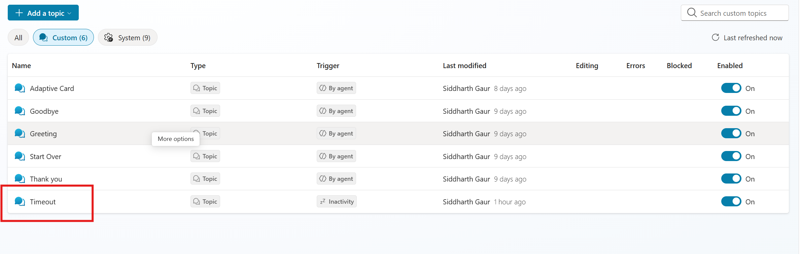
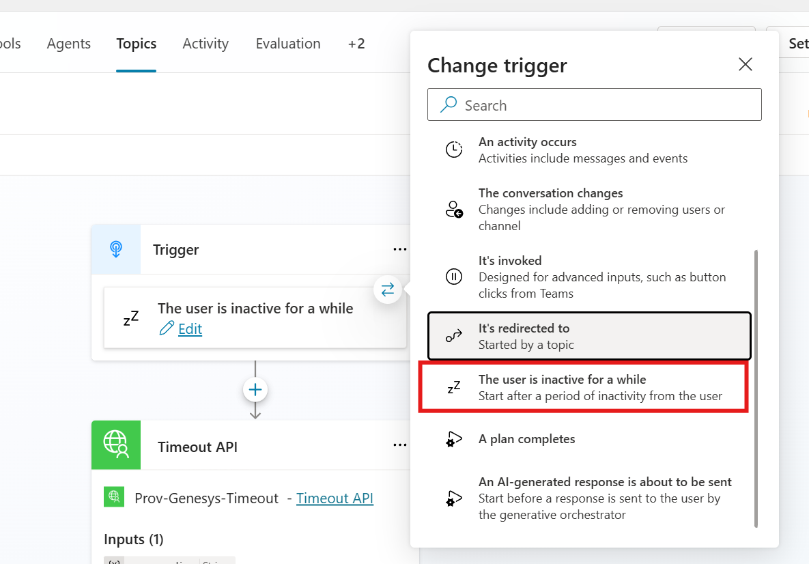

# Custom Connector Setup For Timeout Reset API

This guide explains how to create and configure the Power Platform custom connector that calls the timeout reset endpoint in the Genesys handoff sample.

The connector OpenAPI template is located at:

- customConnectors/MCS-Timeout-Handler.swagger.json

## Introduction

The custom connector is used to call the reset endpoint:

- POST /api/conversations/reset

This endpoint resets an MCS conversation (when allowed by server-side rules) and can optionally send a message to the Teams chat before reset.

Because each tenant/environment has different identity and host values, you must update OAuth and host settings during setup.

## Prerequisites

Before starting, make sure you have:

1. Access to Azure Portal with permission to create/update app registrations.
2. Access to Power Platform where you can create custom connectors.
3. The deployed relay bot hostname (for example App Service URL or dev tunnel URL).
4. The Entra app that represents your relay bot API (the app that exposes the scope your connector will request).

## 1. Create App Registration

Create a dedicated app registration for the custom connector OAuth client.

1. Open Azure Portal.
2. Go to Microsoft Entra ID -> App registrations -> New registration.
3. Enter the values:
  - Name: MCS-Genesys-Timeout-Connector (or your preferred name)
  - Supported account types: Accounts in this organizational directory only (single tenant)
4. Select Register.
5. Save these values from the Overview page:
  - Application (client) ID
  - Directory (tenant) ID

## 2. Configure Authentication Settings

### 2.1 Add Redirect URI

Power Platform generates a connector-specific redirect URI. You must add this URI to the app registration.

1. Open the custom connector in Power Platform (or create it first with minimal settings).
2. Go to Security and select OAuth 2.0.
3. Copy the generated Redirect URL shown by Power Platform.
4. Go back to Azure Portal -> your app registration -> Authentication.
5. Add a Web redirect URI using this format (or paste the exact generated value):

https://global.consent.azure-apim.net/redirect/<your-connector-id>

6. Save changes.

Note:
If you recreate the connector, the connector ID can change. Re-check and update redirect URI if authentication fails.

### 2.2 Create Client Secret

1. Go to Certificates & secrets.
2. Select New client secret.
3. Provide a description and expiry.
4. Select Add.
5. Immediately copy the secret Value and store it securely.

Important:
You cannot retrieve the same secret value again after leaving the page.

## 3. Grant API Permissions

Grant this client app permission to call your relay bot API.

1. Go to API permissions -> Add a permission.
2. Select My APIs.
3. Choose the relay bot API app registration (the Entra app associated with your relay bot/ABS).
4. Select the scope exposed by that API.

If your API exposes a scope named defaultScope, select that scope.

5. Select Add permissions.
6. If required in your tenant, select Grant admin consent.

## 4. Prepare The Swagger Template

Open customConnectors/MCS-Timeout-Handler.swagger.json and update environment-specific values before import.

Update these fields:

1. host
  - Set to your relay bot public hostname only (no https:// and no path).
2. securityDefinitions.oauth2-auth.authorizationUrl
  - Use your tenant-specific authorize URL.
3. securityDefinitions.oauth2-auth.tokenUrl
  - Use your tenant-specific token URL.
4. securityDefinitions.oauth2-auth.scopes key
  - Set to your API scope, for example: api://<app-id-uri>/.default
5. security[].oauth2-auth entry
  - Match the same scope used above.

Do not change the endpoint path in paths:

- /api/conversations/reset

## 5. Import And Configure The Custom Connector

1. In Power Platform, create or edit a custom connector.
2. Import customConnectors/MCS-Timeout-Handler.swagger.json.
3. Verify the action path remains:
  - /api/conversations/reset
4. In Security, configure OAuth 2.0 with values from your app registration:
  - Client ID
  - Client secret
  - Authorization URL
  - Token URL
  - Scope
5. Confirm the Redirect URL shown in connector Security is present in app registration Authentication.
6. In General, confirm host points to your deployed relay bot hostname.
7. Save connector and update connector if prompted.

## 6. Configure Copilot Studio Topic For Timeout

After your connector is imported and authenticated, wire it into a Copilot Studio topic so it runs when the user is inactive.

1. Open Copilot Studio Maker portal.
2. Create a new custom topic.
3. Use the topic layout shown below as reference:



4. In the trigger selection step, choose User is inactive for a while.
5. Use this screenshot as reference for the trigger:



6. In the topic canvas, click the plus (+) button where you want to invoke the reset action.
7. Select Add a tool.
8. Choose Connector.
9. Search for your custom connector name and select it.
10. Select the reset action from your connector and map inputs (for example, conversationId and optional message).
11. Add an End conversation node at the end of the topic flow.
12. Ensure the End conversation node is the final step after the connector action so MCS can close the conversation on its side.
13. Save and publish the topic.

## 7. Test The Connector

Test the timeout reset action with a valid conversation ID.

Expected request body:

- conversationId (required)
- message (optional)

Example:

```json
{
  "conversationId": "<mcs-conversation-id>",
  "message": "The conversation has timed out and was reset."
}
```

Expected API behavior:

1. 200 when reset is accepted/completed.
2. 400 when conversationId is missing.
3. 409 when reset is blocked (for example escalated conversation).
4. 500 for server-side failure.

## Troubleshooting

1. AADSTS redirect URI mismatch
  - Ensure the exact connector redirect URL is added in app registration Authentication.
2. Unauthorized or consent errors
  - Verify API permissions, scope value, and admin consent.
3. Connector cannot reach API
  - Verify host value, HTTPS availability, and that the endpoint path is unchanged.
4. 409 response from reset endpoint
  - Conversation is likely escalated; this is expected behavior by design.
