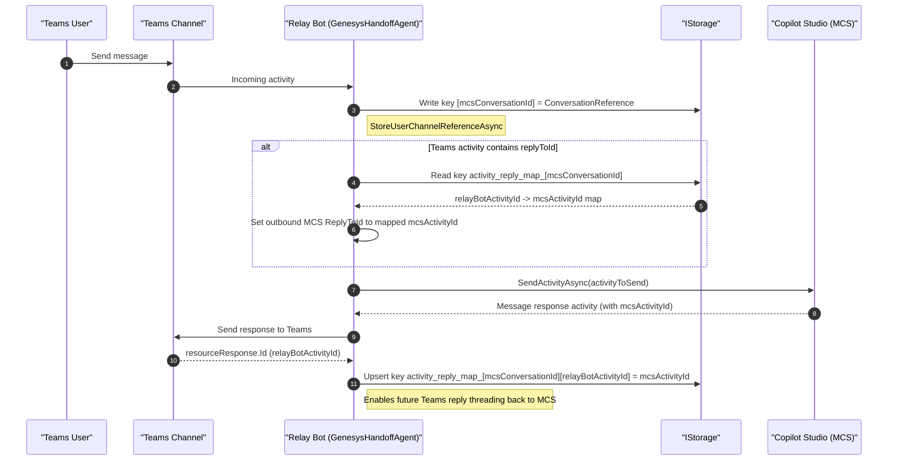
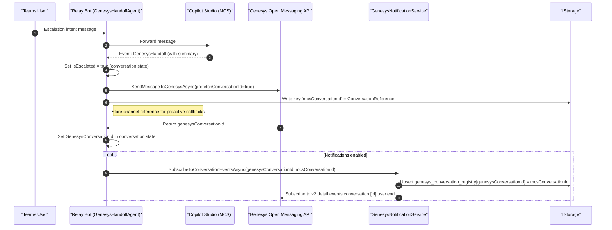
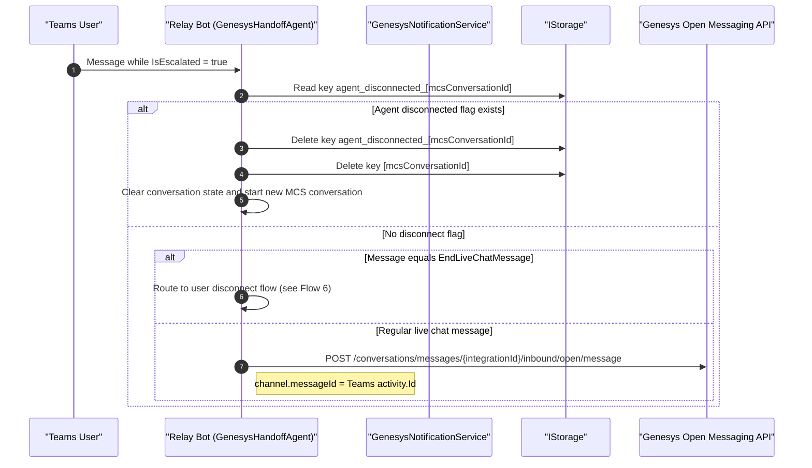
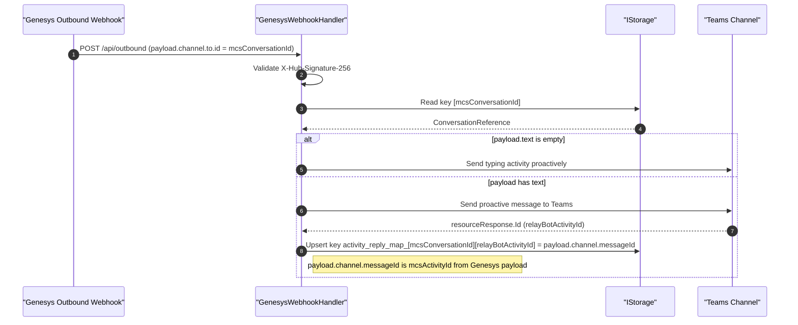
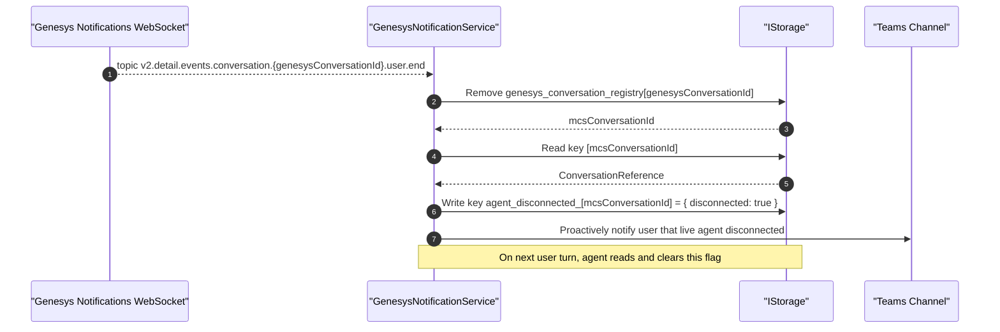
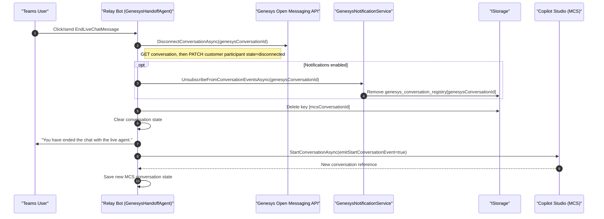
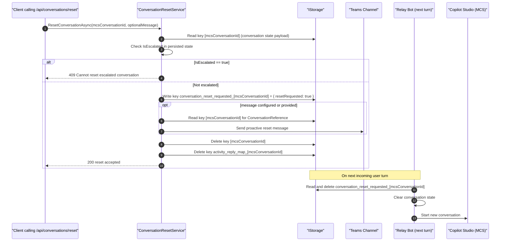

# Genesys Handoff runtime sequence diagrams

This document provides detailed sequence diagrams for the major runtime flows in the Genesys Handoff sample and explicitly calls out what is persisted in storage.

## Storage model used by this sample

The sample uses `IStorage` (currently registered as `MemoryStorage`) as its persistence layer.

Logical records written by the app:

- Conversation reference
  - Key: `<mcsConversationId>`
  - Value: `ConversationReference` for proactive sends to Teams
  - Written by: `GenesysMessageSender.StoreUserChannelReferenceAsync`
  - Deleted by: `GenesysMessageSender.DeleteUserChannelReferenceAsync`

- Activity reply map
  - Key: `activity_reply_map_<mcsConversationId>`
  - Value: dictionary of `relayBotActivityId -> mcsActivityId`
  - Written by: `ActivityReplyMappingStore.UpsertAsync`
  - Deleted by: `ActivityReplyMappingStore.DeleteConversationMappingsAsync`

- Reset requested flag
  - Key: `conversation_reset_requested_<mcsConversationId>`
  - Value: `{ resetRequested: true }`
  - Written by: `ConversationResetService.MarkConversationResetRequestedAsync`
  - Cleared by: `ConversationResetService.CheckAndClearResetRequestedAsync`

- Agent disconnected flag
  - Key: `agent_disconnected_<mcsConversationId>`
  - Value: `{ disconnected: true }`
  - Written by: `GenesysNotificationService.HandleAgentDisconnectAsync`
  - Cleared by: `GenesysNotificationService.CheckAndClearAgentDisconnectedAsync`

- Genesys conversation registry
  - Key: `genesys_conversation_registry`
  - Value: dictionary of `genesysConversationId -> mcsConversationId`
  - Written/updated by: `ConversationMappingStore.AddAsync` and `ConversationMappingStore.RemoveAsync`
  - Loaded by: `ConversationMappingStore.LoadAsync`

Notes:

- Conversation state properties such as `IsEscalated`, `MCSConversationId`, `LastCopilotStudioReference`, and `GenesysConversationId` are managed by the Agent SDK conversation state infrastructure and used throughout these flows.

## 1) Teams user sends message to MCS through relay bot

## 2) User requests escalation

## 3) User sends message while connected to live agent

## 4) Live agent replies back to Teams

## 5) Live agent disconnect event from Genesys

## 6) User explicitly disconnects from live agent

## 7) Conversation reset API is called

## Quick validation checklist

- Teams message forwarding stores `relayBotActivityId -> mcsActivityId` in `activity_reply_map_<mcsConversationId>`.
- Teams reply threading to MCS resolves `incomingActivity.replyToId` through that map before sending to MCS.
- Escalation and disconnect flows keep `genesys_conversation_registry` consistent.
- Reset API removes proactive reference and reply mapping records and sets a deferred reset marker.
