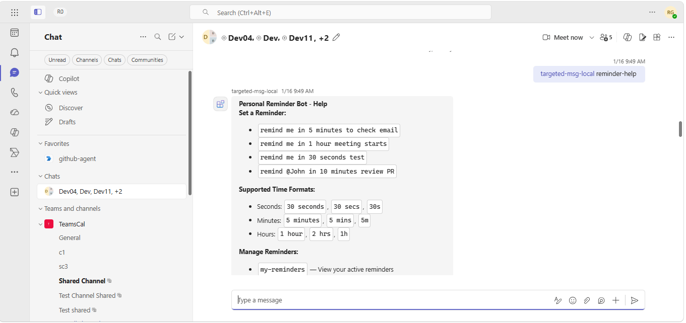

# Agent Targeted Messages

This sample demonstrates targeted messaging in Microsoft Teams with the Microsoft 365 Agents SDK. Targeted messages are private messages in a shared channel or group chat that are visible only to a specific user. The sample implements a reminder agent whose confirmations, deliveries, active-reminder lists, and snooze confirmations can use targeted delivery.



## Features

- Targeted and proactive targeted messages
- Adaptive Cards with `Action.Execute`
- Suggested actions and slash or mention commands
- Reminder creation, listing, cancellation, dismissal, and snoozing
- Message reaction commands and reaction event handling

## Prerequisites

- [.NET 8 SDK](https://dotnet.microsoft.com/download/dotnet/8.0)
- A Microsoft 365 tenant where custom Teams apps can be uploaded
- An Azure Bot or Teams Developer Portal bot
- [Dev Tunnels](https://learn.microsoft.com/azure/developer/dev-tunnels/get-started)

## Configure the agent

Create a single-tenant bot registration with a client secret. Update `appsettings.json` with the tenant ID, client ID, and client secret:

```json
{
  "TokenValidation": {
    "Audiences": [
      "YOUR_CLIENT_ID"
    ],
    "TenantId": "YOUR_TENANT_ID"
  },
  "Connections": {
    "ServiceConnection": {
      "Settings": {
        "AuthType": "ClientSecret",
        "AuthorityEndpoint": "https://login.microsoftonline.com/YOUR_TENANT_ID",
        "ClientId": "YOUR_CLIENT_ID",
        "ClientSecret": "YOUR_CLIENT_SECRET",
        "Scopes": [
          "https://api.botframework.com/.default"
        ]
      }
    }
  }
}
```

Keep the service connection mapped for all channel service URLs:

```json
{
  "ConnectionsMap": [
    {
      "ServiceUrl": "*",
      "Connection": "ServiceConnection"
    }
  ]
}
```

## Run locally in Teams

1. Start an anonymous tunnel for port 3978:

   ```powershell
   devtunnel host -p 3978 --allow-anonymous
   ```

1. Configure the bot messaging endpoint as `https://<tunnel-host>/api/messages`.
1. Replace `${{AAD_APP_CLIENT_ID}}` in `appManifest/manifest.json` with the bot client ID and `<<BOT_DOMAIN>>` with the tunnel host name.
1. Zip the contents of `appManifest` and upload the package as a custom app in Teams.
1. Run the sample:

   ```powershell
   dotnet run --launch-profile AgentTargetedMessages
   ```

## Interact with the agent

Set reminders with messages such as:

- `remind me in 30 seconds test`
- `remind me in 5 minutes to check email`
- `remind me in 1 hour meeting starts`
- `remind @John in 10 minutes review PR`

Supported units include seconds (`seconds`, `secs`, `s`), minutes (`minutes`, `mins`, `m`), and hours (`hours`, `hrs`, `h`).

Manage reminders with:

- `my-reminders`
- `cancel-reminder [id]`
- `reminder-help`
- `add-reaction [type]`
- `remove-reaction [type]`

The app manifest declares `supportsTargetedMessages` and preserves personal, team, and group-chat scopes. It also declares `my-reminders` as a slash command, `remind` as a mention command, and `reminder-help` for both command surfaces.

## Further reading

- [Microsoft 365 Agents SDK](https://learn.microsoft.com/microsoft-365/agents-sdk/)
- [Use the Teams extension for the Microsoft 365 Agents SDK](https://learn.microsoft.com/en-us/microsoft-365/agents-sdk/teams/teams-extension?pivots=dotnet)
- [Targeted messages in Teams](https://learn.microsoft.com/microsoftteams/platform/agents-in-teams/targeted-messages)
- [Agent slash commands](https://learn.microsoft.com/microsoftteams/platform/agents-in-teams/agent-slash-commands)
