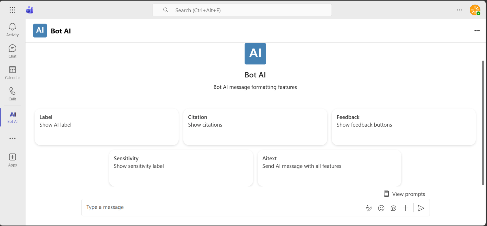

# Bot AI Messages

This sample demonstrates how to enhance AI-generated bot messages for Microsoft Teams using the Microsoft 365 Agents SDK and its Teams extension.

- **AI labels** identify bot messages as AI-generated.
- **Citations** provide source links, summaries, keywords, and an icon.
- **Feedback buttons** collect thumbs-up or thumbs-down reactions and optional written feedback.
- **Sensitivity labels** communicate confidentiality guidance.



## Prerequisites

- [.NET 8 SDK](https://dotnet.microsoft.com/download/dotnet/8.0)
- A Microsoft 365 tenant where you can upload custom Teams apps
- An Azure Bot resource and Microsoft Entra app registration
- [Dev Tunnels CLI](https://learn.microsoft.com/azure/developer/dev-tunnels/get-started)

## Try the features

Send a message containing one of these keywords:

| Keyword | Result |
| --- | --- |
| `label` | Sends a message marked as AI-generated. |
| `feedback` | Sends a message with Teams feedback buttons. Submitted feedback is echoed by the bot. |
| `sensitivity` | Sends a message with a confidentiality label and sharing guidance. |
| `citation` | Sends an AI response with a numbered Microsoft Word citation. |

Matching is case-insensitive. If a message contains multiple keywords, the first match in the order shown above is used. Any other message returns usage guidance.

## Configure the bot

Create a persistent tunnel for port 3978 with anonymous access:

```bash
devtunnel create -a bot-ai-messages
devtunnel port create -p 3978 bot-ai-messages
devtunnel host bot-ai-messages
```

Create an Azure Bot resource backed by a single-tenant Entra app, set its messaging endpoint to `https://<your-devtunnel-domain>/api/messages`, and enable the Microsoft Teams channel.

Replace the placeholders in `appsettings.json` with the Entra app values. Keep credentials out of source control.

```json
{
  "TokenValidation": {
    "Audiences": [ "<client-id>" ],
    "TenantId": "<tenant-id>"
  },
  "Connections": {
    "ServiceConnection": {
      "Settings": {
        "AuthType": "ClientSecret",
        "AuthorityEndpoint": "https://login.microsoftonline.com/<tenant-id>",
        "ClientId": "<client-id>",
        "ClientSecret": "<client-secret>",
        "Scopes": [ "https://api.botframework.com/.default" ]
      }
    }
  },
  "ConnectionsMap": [
    {
      "ServiceUrl": "*",
      "Connection": "ServiceConnection"
    }
  ]
}
```

Update `appManifest/manifest.json`:

- Replace `${{AAD_APP_CLIENT_ID}}` with the Entra app client ID.
- Replace `<<BOT_DOMAIN>>` with the tunnel host name without `https://`.

Zip the contents of `appManifest` so that `manifest.json`, `color.png`, and `outline.png` are at the root of the archive, then upload the package through **Apps > Manage your apps > Upload an app** in Teams.

## Run the sample

```bash
dotnet run --launch-profile BotAiMessages
```

The application listens on `http://localhost:3978` and exposes the bot endpoint at `/api/messages`.

## Troubleshooting

- If Teams cannot reach the bot, verify the Dev Tunnels URL is active and the Azure Bot messaging endpoint ends in `/api/messages`.
- If requests return 401, verify the client ID and tenant ID in `TokenValidation` and the connection settings.
- If outbound replies fail, verify the client secret and that the Teams channel is enabled on the Azure Bot resource.
- Use the Azure Bot resource's Channels page to inspect endpoint errors.

## Further reading

- [Microsoft 365 Agents SDK](https://learn.microsoft.com/microsoft-365/agents-sdk/)
- [Use the Teams extension for the Microsoft 365 Agents SDK](https://learn.microsoft.com/en-us/microsoft-365/agents-sdk/teams/teams-extension?pivots=dotnet)
- [Bot messages with AI-generated content](https://learn.microsoft.com/microsoftteams/platform/bots/how-to/bot-messages-ai-generated-content)
- [Dev Tunnels documentation](https://learn.microsoft.com/azure/developer/dev-tunnels/)
