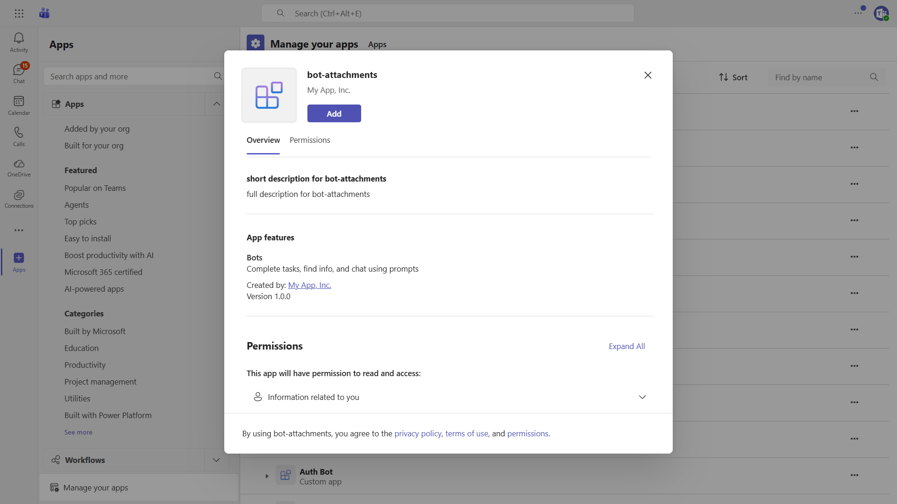

# Bot Attachments Sample

This sample demonstrates how to receive file attachments in Microsoft Teams, request file consent, and upload accepted files to the user's OneDrive using the Microsoft 365 Agents SDK and its Teams extension.



## Features

- **File download** - Receives files sent as attachments in a Teams chat.
- **File consent card** - Requests permission before uploading a received file.
- **OneDrive upload** - Uploads accepted files and sends a file info card with a link.
- **Decline handling** - Removes the pending upload and notifies the user.
- **Proactive completion** - A hosted background service performs the upload and proactively sends the result without retaining the incoming turn context.

## Prerequisites

- [.NET 8 SDK](https://dotnet.microsoft.com/download/dotnet/8.0)
- [Dev tunnels](https://learn.microsoft.com/azure/developer/dev-tunnels/get-started)
- An Azure Bot configured with the Microsoft Teams channel

## Configure the sample

Update `appsettings.json` with the client ID, tenant ID, and client secret from your Azure Bot registration:

```json
{
  "TokenValidation": {
    "Audiences": [ "<client-id>" ],
    "TenantId": "<tenant-id>"
  },
  "Connections": {
    "ServiceConnection": {
      "Settings": {
        "AuthorityEndpoint": "https://login.microsoftonline.com/<tenant-id>",
        "ClientId": "<client-id>",
        "ClientSecret": "<client-secret>"
      }
    }
  }
}
```

This sample uses the Teams file consent flow and does not require Microsoft Graph application permissions.

## Run the sample

1. Start a persistent public dev tunnel for port 3978:

   ```bash
   devtunnel create -a my-tunnel
   devtunnel port create -p 3978 my-tunnel
   devtunnel host my-tunnel
   ```

1. Set the Azure Bot messaging endpoint to `https://<your-tunnel-domain>/api/messages`.
1. From this directory, start the sample:

   ```bash
   dotnet run --launch-profile BotAttachments
   ```

The agent listens on `http://localhost:3978`.

## App package and testing in Teams

Ensure the Azure Bot has the Microsoft Teams channel enabled. Create or update a Teams app package whose bot ID is your client ID and whose bot scopes include `personal`, then upload the package as a custom app in Teams. No resource-specific consent or Graph permissions are required.

Attach a file or image in a personal chat with the bot. The bot downloads the attachment and displays a file consent card. Accepting the card starts the OneDrive upload; declining it removes the pending file.

## Further reading

- [Microsoft 365 Agents SDK](https://learn.microsoft.com/microsoft-365/agents-sdk/)
- [Use the Teams extension for the Microsoft 365 Agents SDK](https://learn.microsoft.com/en-us/microsoft-365/agents-sdk/teams/teams-extension?pivots=dotnet)
- [Send and receive files using bots](https://learn.microsoft.com/microsoftteams/platform/bots/how-to/bots-filesv4)
