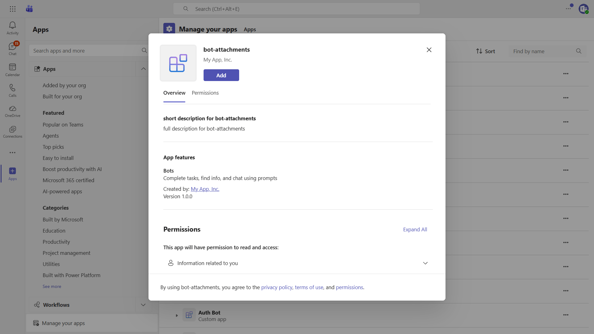

# Agent Attachments - .NET (C#)

This sample demonstrates how to send and receive file attachments in Microsoft Teams using an agent built with the Microsoft 365 Agents SDK. When a user sends a file, the agent downloads it, requests consent via a File Consent Card, and uploads the file to the user's OneDrive upon acceptance.

It targets [Microsoft 365 Agents SDK](https://learn.microsoft.com/microsoft-365/agents-sdk/) with the Teams extension (`Microsoft.Agents.Extensions.MSTeams`).



## Prerequisites

- [.NET 10 SDK](https://dotnet.microsoft.com/download/dotnet/10.0)
- [Dev tunnels](https://learn.microsoft.com/azure/developer/dev-tunnels/get-started)
- An Azure Bot configured with the Microsoft Teams channel

## Configuration

Agent credentials use the Agents SDK MSAL configuration in [appsettings.json](appsettings.json):

```json
{
  "TokenValidation": {
    "Audiences": [ "{{ClientId}}" ],
    "TenantId": "{{TenantId}}"
  },
  "Connections": {
    "ServiceConnection": {
      "Settings": {
        "AuthorityEndpoint": "https://login.microsoftonline.com/{{TenantId}}",
        "ClientId": "{{ClientId}}",
        "ClientSecret": null
      }
    }
  }
}
```

Create an ignored `appsettings.Development.json` with your credentials from your Azure Bot registration. It overrides the checked-in `appsettings.json` when you run the Development launch profile:

```json
{
  "TokenValidation": {
    "Audiences": [ "your-client-id" ],
    "TenantId": "your-tenant-id"
  },
  "Connections": {
    "ServiceConnection": {
      "Settings": {
        "AuthorityEndpoint": "https://login.microsoftonline.com/your-tenant-id",
        "ClientId": "your-client-id",
        "ClientSecret": "your-client-secret"
      }
    }
  }
}
```

This sample uses the Teams file consent flow and does not require Microsoft Graph application permissions.

## Run the sample

1. Navigate to this directory:
   ```bash
   cd samples/dotnet/teams/bot-attachments
   ```

2. Copy the example launch settings file:
   ```bash
   cp Properties/launchSettings.EXAMPLE.json Properties/launchSettings.json
   ```

3. Start a persistent public dev tunnel for port 3978:
   ```bash
   devtunnel create -a my-tunnel
   devtunnel port create -p 3978 my-tunnel
   devtunnel host my-tunnel
   ```

4. Set the Azure Bot messaging endpoint to `https://<your-tunnel-domain>/api/messages`.

5. Restore dependencies and run:
   ```bash
   dotnet run --launch-profile BotAttachments
   ```

The agent will start listening on `http://localhost:3978`.

## Features

- **File receive**: Accepts files sent by the user in a Teams chat.
- **File Consent Card**: Requests user permission before uploading to OneDrive.
- **OneDrive upload**: On acceptance, uploads the file and sends a File Info Card with a link.
- **Decline handling**: Notifies the user gracefully when consent is declined.
- **Proactive completion**: A hosted background service performs the upload and proactively sends the result without retaining the incoming turn context.

## App package and testing in Teams

Ensure the Azure Bot has the Microsoft Teams channel enabled. Create or update a Teams app package whose bot ID is your client ID and whose bot scopes include `personal`, then upload the package as a custom app in Teams. No resource-specific consent or Graph permissions are required.

Attach a file or image in a personal chat with the agent. The agent downloads the attachment and displays a file consent card. Accepting the card starts the OneDrive upload; declining it removes the pending file.

## Further reading

- [Microsoft 365 Agents SDK](https://learn.microsoft.com/microsoft-365/agents-sdk/)
- [Use the Teams extension for the Microsoft 365 Agents SDK](https://learn.microsoft.com/en-us/microsoft-365/agents-sdk/teams/teams-extension?pivots=dotnet)
- [Send and receive files using bots](https://learn.microsoft.com/microsoftteams/platform/bots/how-to/bots-filesv4)
