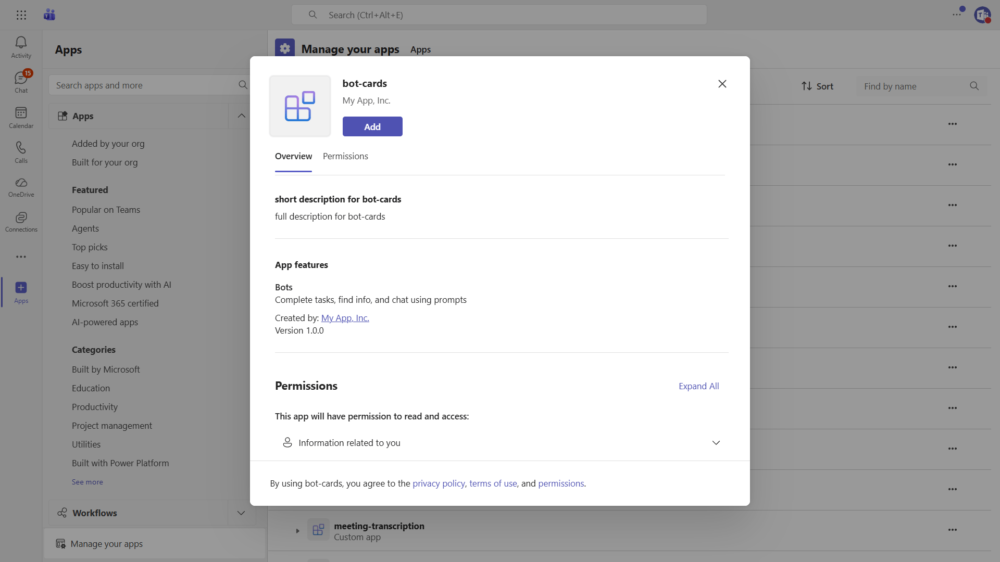

# Agent Cards Sample

This sample demonstrates how to interact with adaptive cards in Microsoft Teams using an agent built with the Microsoft 365 Agents SDK and its Teams extension.



## Features

- **Card Actions** - Adaptive card with `Action.OpenUrl`, `Action.Execute`, and nested `Action.ShowCard` behaviors.
- **Toggle Visibility** - Adaptive card with `Action.ToggleVisibility` to show or hide content.

The agent responds to these commands:

| Command | Description |
|---|---|
| `card actions` | Sends an adaptive card showcasing several card actions. |
| `toggle visibility` | Sends a card demonstrating `Action.ToggleVisibility`. |

## Prerequisites

- [.NET 10 SDK](https://dotnet.microsoft.com/download/dotnet/10.0)
- [Dev tunnels](https://learn.microsoft.com/azure/developer/dev-tunnels/get-started)
- An Azure Bot configured with the Microsoft Teams channel

## Configure the sample

Create an ignored `appsettings.Development.json` with the client ID, tenant ID, and client secret from your Azure Bot registration. It overrides the corresponding values in the checked-in `appsettings.json` when you run the Development launch profile:

```json
{
  "TokenValidation": {
    "Audiences": [ "<client-id>" ],
    "TenantId": "<tenant-id>"
  },
  "Connections": {
    "ServiceConnection": {
      "Settings": {
        "AuthorityEndpoint": "https://login.microsoftonline.com/<tenant-id>",
        "ClientId": "<client-id>",
        "ClientSecret": "<client-secret>"
      }
    }
  }
}
```

## Run the sample

1. Start a public dev tunnel for port 3978:

   ```bash
   devtunnel host -p 3978 --allow-anonymous
   ```

1. Set the Azure Bot messaging endpoint to `https://<your-tunnel-domain>/api/messages`.
1. From this directory, start the sample:

   ```bash
   dotnet run --launch-profile BotCards
   ```

The agent listens on `http://localhost:3978`.

## Testing in Teams

Ensure the Azure Bot has the Microsoft Teams channel enabled, then upload a Teams app package whose bot ID is your client ID and whose bot scopes include the contexts where you want to use the sample.

## Further reading

- [Microsoft 365 Agents SDK](https://learn.microsoft.com/microsoft-365/agents-sdk/)
- [Use the Teams extension for the Microsoft 365 Agents SDK](https://learn.microsoft.com/en-us/microsoft-365/agents-sdk/teams/teams-extension?pivots=dotnet)
- [Adaptive Cards](https://adaptivecards.io/)
