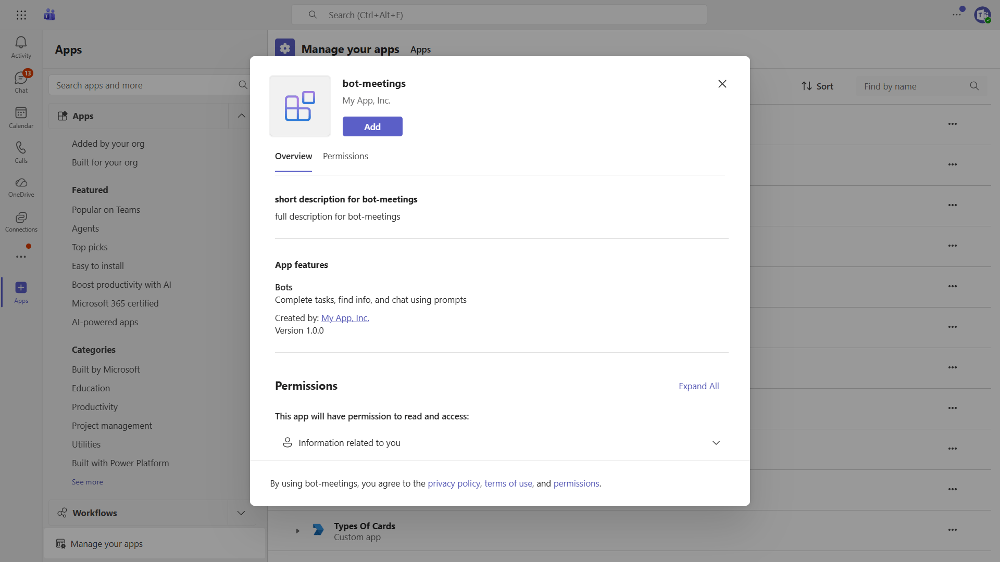
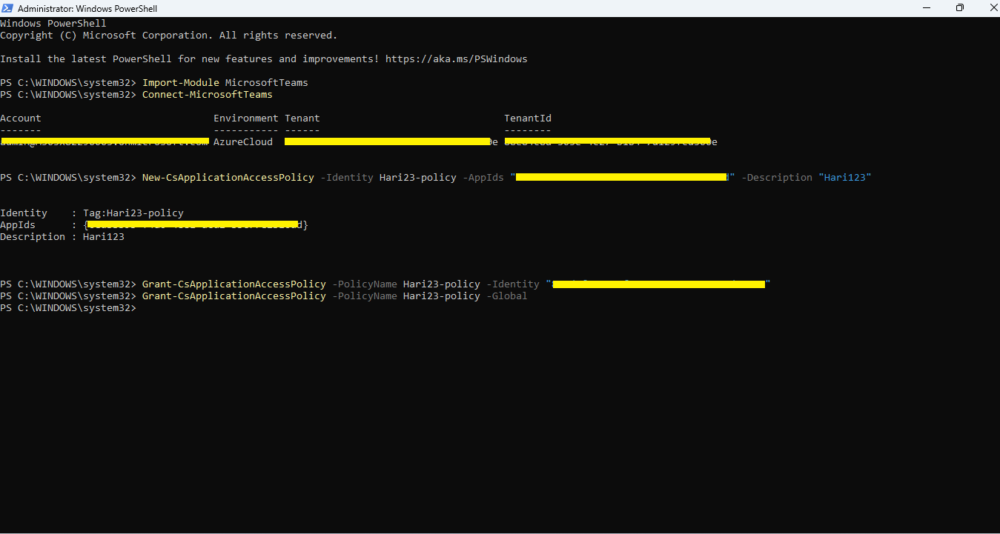
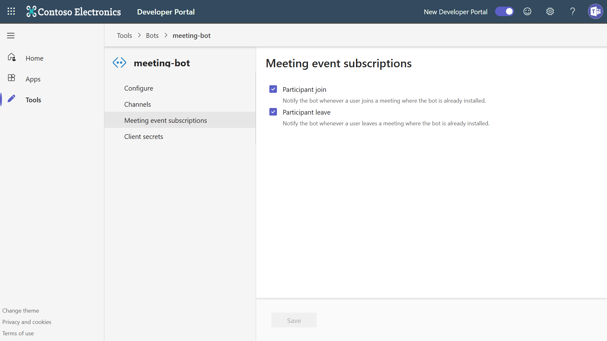

# Bot Meetings Sample

This sample demonstrates how to handle real-time Microsoft Teams meeting events and retrieve meeting transcripts with a bot built on the Microsoft 365 Agents SDK and its Teams extension.



## Features

- **Meeting lifecycle events** - Sends adaptive cards when a meeting starts or ends.
- **Participant events** - Announces when a participant joins or leaves and includes the participant's meeting role when available.
- **Meeting transcripts** - Uses an independent app-only Microsoft Graph client to retrieve and display the latest meeting transcript after a meeting ends.
- **Meeting cards** - Includes meeting details and a join link in adaptive cards.

The sample responds to meeting events rather than chat commands.

## Prerequisites

- [.NET 8 SDK](https://dotnet.microsoft.com/download/dotnet/8.0)
- Microsoft Teams and a Microsoft 365 account that can install custom apps
- [Dev tunnels](https://learn.microsoft.com/azure/developer/dev-tunnels/get-started) or another public HTTPS tunnel
- A Teams-managed bot registration. Meeting event subscriptions aren't available to an Azure Bot resource.
- [Teams Developer CLI](https://microsoft.github.io/teams-sdk/cli/installation): `npm install -g @microsoft/teams.cli`
- A tenant administrator who can grant Microsoft Graph application permissions and configure an application access policy

## Configure the sample

Start a public tunnel for port 3978:

```bash
devtunnel host -p 3978 --allow-anonymous
```

Sign in and create a Teams-managed app with the bot endpoint set to your tunnel:

```bash
teams login
teams app create --name "Bot Meetings" --teams-managed --endpoint https://<your-tunnel-domain>/api/messages
```

Update `appsettings.json` with the app registration values. The bot connection and the app-only Graph client use the same registration but remain independently configured:

```json
{
  "TokenValidation": {
    "Audiences": [ "<client-id>" ],
    "TenantId": "<tenant-id>"
  },
  "Connections": {
    "ServiceConnection": {
      "Settings": {
        "AuthorityEndpoint": "https://login.microsoftonline.com/<tenant-id>",
        "ClientId": "<client-id>",
        "ClientSecret": "<client-secret>"
      }
    }
  },
  "Graph": {
    "TenantId": "<tenant-id>",
    "ClientId": "<client-id>",
    "ClientSecret": "<client-secret>"
  }
}
```

The sample starts without Graph credentials, but meeting transcripts aren't retrieved until all three `Graph` values are configured.

## Configure Microsoft Graph

In the [Microsoft Entra admin center](https://go.microsoft.com/fwlink/?linkid=2083908), add these Microsoft Graph **application** permissions to the app registration and grant tenant-wide admin consent:

- `OnlineMeetings.Read.All`
- `OnlineMeetingTranscript.Read.All`

Configure an online meeting application access policy for the users whose meetings the bot accesses:

- [Configure an application access policy](https://learn.microsoft.com/graph/cloud-communication-online-meeting-application-access-policy)
- [Manage Teams policies with PowerShell](https://learn.microsoft.com/microsoftteams/teams-powershell-managing-teams#manage-policies-via-powershell)



## Configure Teams permissions and meeting events

Use the Teams app ID returned by `teams app create` to add the required resource-specific consent permissions:

```bash
teams app rsc add <teams-app-id> OnlineMeeting.ReadBasic.Chat --type Application
teams app rsc add <teams-app-id> OnlineMeetingTranscript.Read.Chat --type Application
teams app rsc add <teams-app-id> ChannelMeeting.ReadBasic.Group --type Application
teams app rsc add <teams-app-id> OnlineMeetingParticipant.Read.Chat --type Application
```

In the [Teams Developer Portal](https://dev.teams.microsoft.com), open **Tools** > **Bot management**, select the bot, and enable the **Participant Join** and **Participant Leave** meeting event subscriptions.



Ensure the app manifest's bot entry supports meetings:

```json
{
  "bots": [
    {
      "botId": "<client-id>",
      "scopes": [ "team", "personal", "groupChat" ],
      "isNotificationOnly": false
    }
  ]
}
```

Package and upload the Teams app:

```bash
teams app package
teams app update <teams-app-id> --file appPackage/<package>.zip
```

## Run the sample

From this directory, run:

```bash
dotnet run --launch-profile BotMeetings
```

The agent listens on `http://localhost:3978`. Add the packaged app to a meeting, then start or end the meeting or have a participant join or leave to exercise the corresponding event.

Meeting transcripts can take time to become available. The sample waits 30 seconds after the meeting-end event, retrieves the newest VTT transcript through Microsoft Graph, and displays parsed speaker lines in the meeting-end card.

## Troubleshooting

- Verify the public tunnel routes to port 3978 and the bot endpoint ends in `/api/messages`.
- Confirm admin consent was granted for both Graph application permissions.
- Confirm the meeting organizer is covered by the application access policy.
- Confirm participant join and leave subscriptions are enabled on the Teams-managed bot.
- Confirm the app manifest includes the required bot scopes and RSC permissions, then repackage and upload it.

## Further reading

- [Microsoft 365 Agents SDK](https://learn.microsoft.com/microsoft-365/agents-sdk/)
- [Use the Teams extension for the Microsoft 365 Agents SDK](https://learn.microsoft.com/en-us/microsoft-365/agents-sdk/teams/teams-extension?pivots=dotnet)
- [Meeting participant events](https://learn.microsoft.com/microsoftteams/platform/apps-in-teams-meetings/meeting-apps-apis?tabs=dotnet#receive-meeting-participant-events)
- [Microsoft Graph meeting transcripts](https://learn.microsoft.com/graph/api/resources/calltranscript)
