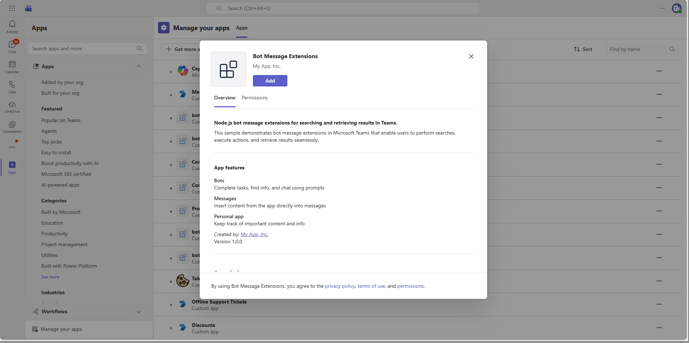

# Bot Message Extensions Sample

This sample demonstrates a search-based messaging extension in Microsoft Teams using the Microsoft 365 Agents SDK and its Teams extension. It lets users search for Wikipedia articles from the compose area and creates rich previews for Wikipedia links.



## Features

- **Wikipedia Search** - Searches Wikipedia from the Teams compose area and returns adaptive card results.
- **Link Unfurling** - Generates an adaptive card preview when a Wikipedia URL is shared.
- **Bot Messages** - Responds with help when a message contains `help` and echoes other messages.

The `wikipediaSearch` command ID, query parameter, result cards, matching behavior, and response text match the upstream Teams SDK sample.

## Prerequisites

- [.NET 8 SDK](https://dotnet.microsoft.com/download/dotnet/8.0)
- [Dev tunnels](https://learn.microsoft.com/azure/developer/dev-tunnels/get-started)
- An Azure Bot configured with the Microsoft Teams channel
- Access to a Microsoft 365 tenant where you can upload custom Teams apps

## Configure the sample

Update `appsettings.json` with the client ID, tenant ID, and client secret from your Azure Bot registration:

```json
{
  "TokenValidation": {
    "Audiences": [ "<client-id>" ],
    "TenantId": "<tenant-id>"
  },
  "Connections": {
    "ServiceConnection": {
      "Settings": {
        "AuthorityEndpoint": "https://login.microsoftonline.com/<tenant-id>",
        "ClientId": "<client-id>",
        "ClientSecret": "<client-secret>"
      }
    }
  }
}
```

For local development, replace the placeholders in `appsettings.json` while keeping the existing JSON structure:

```json
{
  "TokenValidation": {
    "Audiences": [
      "<client-id>"
    ],
    "TenantId": "<tenant-id>"
  },
  "Connections": {
    "ServiceConnection": {
      "Settings": {
        "AuthType": "ClientSecret",
        "AuthorityEndpoint": "https://login.microsoftonline.com/<tenant-id>",
        "ClientId": "<client-id>",
        "ClientSecret": "<client-secret>",
        "Scopes": [
          "https://api.botframework.com/.default"
        ]
      }
    }
  }
}
```

Do not commit an `appsettings.json` file containing real credentials.

## Run the sample

1. Start a public dev tunnel for port 3978:

   ```bash
   devtunnel host -p 3978 --allow-anonymous
   ```

1. Set the Azure Bot messaging endpoint to `https://<your-tunnel-domain>/api/messages`.
1. From this directory, start the sample:

   ```bash
   dotnet run --launch-profile BotMessageExtensions
   ```

The agent listens on `http://localhost:3978`.

## Configure the Teams app package

The `appPackage` directory contains the Teams manifest and icons. Replace `${{BOT_ID}}` with the Azure Bot client ID and `${{APP_NAME_SUFFIX}}` with an optional suffix, then package the three files in that directory into a ZIP archive.

The manifest preserves the upstream message extension configuration:

- Query command ID: `wikipediaSearch`
- Contexts: `compose` and `commandBox`
- Query parameter: `searchQuery`
- Link-unfurling domain: `*.wikipedia.org`
- Bot endpoint: `/api/messages`, configured on the Azure Bot resource

Upload the ZIP as a custom app in Teams. In the compose area, open **Apps**, select **Wikipedia Search**, and search for an article. Paste a Wikipedia URL to test link unfurling.

## Further reading

- [Microsoft 365 Agents SDK](https://learn.microsoft.com/microsoft-365/agents-sdk/)
- [Use the Teams extension for the Microsoft 365 Agents SDK](https://learn.microsoft.com/en-us/microsoft-365/agents-sdk/teams/teams-extension?pivots=dotnet)
- [Message extensions overview](https://learn.microsoft.com/microsoftteams/platform/messaging-extensions/what-are-messaging-extensions)
- [Search commands](https://learn.microsoft.com/microsoftteams/platform/messaging-extensions/how-to/search-commands/define-search-command)
- [Link unfurling](https://learn.microsoft.com/microsoftteams/platform/messaging-extensions/how-to/link-unfurling)
