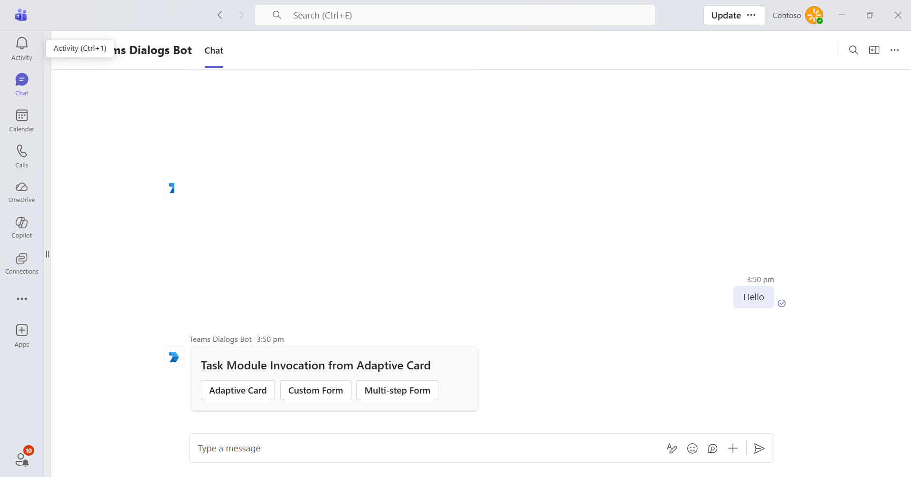

# Agent Task Modules Sample

This sample demonstrates task modules (dialogs) in Microsoft Teams using an agent built with the Microsoft 365 Agents SDK and its Teams extension.



## Features

- **Adaptive Card task module** - Opens a card-based dialog, collects multiline text, and confirms the submitted value.
- **Custom form task module** - Hosts an HTML and JavaScript form at `/customform`, collects a name and email address, and submits the values to the agent.
- **Multistep task module** - Collects a name on the first Adaptive Card, carries it into a second card, collects an email address, and sends a personalized confirmation.

## Prerequisites

- [.NET 10 SDK](https://dotnet.microsoft.com/download/dotnet/10.0)
- [Dev tunnels](https://learn.microsoft.com/azure/developer/dev-tunnels/get-started)
- An Azure Bot configured with the Microsoft Teams channel

## Configure the sample

Create an ignored `appsettings.Development.json` with the client ID, tenant ID, client secret, and public agent domain from your Azure Bot registration and dev tunnel. It overrides the corresponding values in the checked-in `appsettings.json` when you run the Development launch profile:

```json
{
  "BotEndpoint": "https://<your-tunnel-domain>",
  "TokenValidation": {
    "Audiences": [ "<client-id>" ],
    "TenantId": "<tenant-id>"
  },
  "Connections": {
    "ServiceConnection": {
      "Settings": {
        "AuthorityEndpoint": "https://login.microsoftonline.com/<tenant-id>",
        "ClientId": "<client-id>",
        "ClientSecret": "<client-secret>"
      }
    }
  }
}
```

`BotEndpoint` must be the public HTTPS origin without a trailing slash. The custom form task module uses it to create the `/customform` URL.

## Run the sample

1. Start a public dev tunnel for port 3978:

   ```bash
   devtunnel host -p 3978 --allow-anonymous
   ```

1. Set the Azure Bot messaging endpoint to `https://<your-tunnel-domain>/api/messages`.
1. From this directory, start the sample:

   ```bash
   dotnet run --launch-profile BotTaskModules
   ```

The agent listens on `http://localhost:3978`. Send any message to receive the card that opens the three task module experiences.

## Testing in Teams

Ensure the Azure Bot has the Microsoft Teams channel enabled, then upload a Teams app package whose bot ID is your client ID. The app needs a `personal` scope and your tunnel domain in `validDomains` so Teams can load the custom form.

## Further reading

- [Microsoft 365 Agents SDK](https://learn.microsoft.com/microsoft-365/agents-sdk/)
- [Use the Teams extension for the Microsoft 365 Agents SDK](https://learn.microsoft.com/en-us/microsoft-365/agents-sdk/teams/teams-extension?pivots=dotnet)
- [Task modules in Microsoft Teams](https://learn.microsoft.com/microsoftteams/platform/task-modules-and-cards/what-are-task-modules)
- [Invoke and dismiss task modules](https://learn.microsoft.com/microsoftteams/platform/task-modules-and-cards/task-modules/invoking-task-modules)
